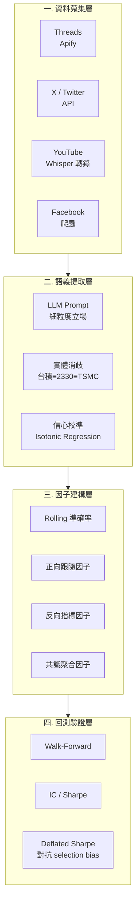

# 評審簡報大綱 — 多 KOL 跨平台量化情緒因子系統

> **用途**：本文件為 Claude Design / 投影片生成工具的輸入素材
> **講者**：施博瀚（Stan Shih）／ 師大資工系
> **場合**：專題評審口頭報告（7 分鐘 + Q&A）
> **評分權重**：問題描述 20% / 方法與創新 60% / 實驗有效性 20%
> **語言**：繁體中文

---

## 〇、設計指引（給簡報生成工具）

- **頁數**：7 張投影片（含 Title），平均每頁 60 秒
- **風格**：學術簡報，深色背景，重點數字大字級突出
- **字級**：標題 ≥ 36pt，內文 ≥ 24pt
- **每頁限制**：最多 5 個 bullet
- **必備視覺**：第 4 頁系統架構圖、第 5 頁四個 contribution 對照表、第 6 頁實驗設計
- **配色**：主色 #1E3A8A（深藍）、強調 #F59E0B（橘）、背景 #0F172A
- **避免**：所有 emoji

---

# 部分 A：投影片內容

---

## Slide 1：Title

**標題**：多 KOL 跨平台量化情緒因子系統

**副標**：A Multi-KOL Cross-Platform Sentiment Factor System for Taiwan Equity Markets

**講者資訊**：
- 施博瀚 / 師大資工系
- 指導教授：[填入]
- 2026 / [月份]

**視覺**：
- 多個頭像剪影（代表 KOL）→ 訊號箭頭 → 因子矩陣 → Sharpe 曲線
- 帶台股 + Threads/X/YouTube logo（極淡）

---

## Slide 2：研究問題（佔 20%）

**標題**：散戶意見領袖的影響力，從未被系統性量化

**核心觀察**：
- 台灣財經 KOL 在 Threads / X / YouTube 上的言論，**直接影響數十萬散戶**
- 散戶群體行為早於市場定價，存在**短暫可交易視窗**
- **目前無任何系統**將此影響力轉化為可回測的量化因子

**現有研究的缺口**：

| 既有研究 | 缺口 |
|---|---|
| Twitter 整體情緒 → 指數預測 | 太粗糙，沒區分 KOL 個體差異 |
| Reddit r/WSB → 個股動量 | 英文市場，中文財經 KOL 幾乎無人研究 |
| 財經新聞 NLP | 媒體是落後指標，KOL 更即時 |
| banini-tracker（開源） | 只追蹤一個 KOL，無因子化、無回測 |

**核心命題**：
> KOL 的**預測品質本身就是一個可量化的 latent variable**。
> 動態追蹤其 rolling 準確率 → 可建構出有 IC 的因子。

---

## Slide 3：價值與挑戰（接續 20%）

**標題**：為什麼這是個值得做的問題

**價值（左半邊）**：
- **學術**：中文財經 NLP × 量化因子 × 動態信任度 — 三者交集是空白地帶
- **產業**：台灣量化基金正在追求「另類數據因子」，KOL 是被忽視的金礦
- **方法論**：可遷移至其他「噪音資料 → 結構化訊號」的問題（醫療、政治）

**挑戰（右半邊）**：

| 挑戰 | 具體問題 |
|---|---|
| **NLP** | 中文 KOL 用語混雜（俚語、emoji、暗示），LLM 提取的細粒度立場（加碼/被套/停損）難 |
| **校準** | LLM 給的「信心 0.8」實際勝率是 80% 嗎？需 calibration |
| **資料完整性** | Point-in-time 嚴格性（不能用未來資訊回測過去） |
| **多模態** | 文字 + Whisper 轉錄 + 影片，如何融合 |
| **因果性** | KOL 言論是「造成」還是「預測」股價？ |

---

## Slide 4：系統架構（方法論 60% — 主菜 1）

**標題**：四層 Pipeline

**Mermaid 架構圖**：

**技術選型**：
- 爬蟲：Apify + 自寫 fallback（Threads / X 反爬日益嚴格）
- 語音：Whisper large-v3-turbo（已實作於 Track A）
- LLM：Claude / GPT 雙模型 cross-check
- 資料庫：SQLite + Parquet（point-in-time bitemporal schema）
- 回測：vectorbt + 自寫 walk-forward 框架

---

## Slide 5：創新性 — 四個 Personal Contribution（60% — 主菜 2）

**標題**：四個與既有研究的差異化貢獻

| 維度 | 既有做法 | **本研究** |
|---|---|---|
| **追蹤對象** | 單一 KOL（banini-tracker） | **多 KOL 跨平台聚合** |
| **立場提取** | 二元情感（正/負） | **六態細粒度（買入/加碼/被套/停損/觀察/反指標）** |
| **信任度** | 靜態評估 | **Rolling 動態 + Bayesian 校準** |
| **資料模態** | 純文字 | **文字 + 語音轉錄(YouTube/Podcast)** |
| **回測嚴謹性** | 簡單看勝率 | **Walk-Forward + IC 衰減 + Deflated Sharpe** |

**四個 Personal Contribution**：

1. **動態 Bayesian 信任度框架**
   - 用 Beta-Binomial 共軛先驗追蹤每位 KOL 的條件勝率
   - 條件變數：市場狀態 / 標的板塊 / 預測時間框
   - **這是現有任何 KOL 追蹤系統沒做的**

2. **LLM 信心校準 (Calibration)**
   - LLM 自評信心 → 經 isotonic regression 校準到實際勝率
   - 產出 reliability diagram 作為驗證
   - **少見地把 calibration literature 引入 NLP × 金融**

3. **Point-in-Time Bitemporal Schema**
   - 嚴格區分「事件時間」與「系統知曉時間」
   - 確保回測 100% 無 look-ahead bias
   - **多數開源量化研究的硬傷,本系統從資料層解決**

4. **多模態訊號融合**
   - 文字立場 + 語音語氣(Whisper 轉錄後再做 prosody)
   - 加權融合層用簡單 logistic regression 確保可解釋性
   - **跨模態加值多少」是可量化的研究問題**

---

## Slide 6:實驗設計(佔 20%)

**標題**:三層實驗驗證有效性

### 層 1:NLP 提取品質
- **資料**:200 筆人工標註的 KOL 貼文(自建)
- **量測**:立場分類 F1、實體消歧 accuracy、LLM 信心 calibration error
- **預期**:F1 ≥ 0.75,calibration ECE ≤ 0.05

### 層 2:因子有效性
- **資料**:5 位 KOL × 12 個月 × 30 個台股標的
- **量測**:每個 KOL 的 rolling IC、聚合因子的 IC、IC 衰減曲線
- **預期**:單 KOL IC ≥ 0.03、聚合 IC ≥ 0.05(統計顯著)

### 層 3:策略有效性
- **資料**:組合多 KOL 因子 + Alpha101,跑 walk-forward 回測
- **量測**:
  - Out-of-sample Sharpe
  - Deflated Sharpe(扣除 multiple-testing bias 後)
  - 最大回撤、Calmar ratio
- **預期**:OOS Sharpe ≥ 1.5,Deflated Sharpe ≥ 1.0

**對照組**:
| 系統 | 預期 OOS Sharpe |
|---|---|
| Buy-and-Hold 0050 | ~0.5 |
| 純 Alpha101 因子 | ~0.8 |
| 單一 KOL 跟隨 | ~0.6 |
| **本系統(KOL+Alpha101)** | **目標 1.5+** |

---

## Slide 7:時程與結語

**標題**:兩學期里程碑 + 預期貢獻

**現有進度(已完成)**:
- Facebook / Podcast 資料管道
- Whisper large-v3-turbo 中文轉錄
- LLM extract POC
- 台股 + 美股價格快取系統

**第一學期(深化)**:
- 月 1:擴張至 5 KOL × 4 平台、bitemporal DB schema
- 月 2:細粒度立場提取 + LLM calibration
- 月 3:Bayesian 動態信任度框架
- 月 4:三類因子計算 + 第一份 IC 報告

**第二學期(整合 + 驗證)**:
- 月 5:多模態融合(文字 + 語音 prosody)
- 月 6:Walk-forward + Deflated Sharpe 框架
- 月 7:與 Alpha101 整合策略
- 月 8:完整實驗 + 報告 + Demo Web App

**預期貢獻**:
1. **資料面**:首個系統性追蹤的中文財經 KOL 量化資料集
2. **方法面**:LLM calibration + Bayesian 信任度的工業實踐
3. **實證面**:KOL 量化因子有效性的首份學術級驗證

**結語**:
> 「KOL 的話本來只是噪音,但加上時間維度與校準後,它是訊號。本系統把這個轉換工程化、嚴謹化。」

---

# 部分 B:講者腳本(嚴格 7 分鐘 = 420 秒)

| 時間 | 投影片 | 講稿 |
|---|---|---|
| **0:00–0:30** | Slide 1 | 「各位老師好,我是師大資工系的施博瀚。今天報告的專題是『多 KOL 跨平台量化情緒因子系統』。簡單說,就是把網紅講的話,變成可以下單的量化訊號。」 |
| **0:30–1:50** | Slide 2 問題 | 「先講為什麼這是問題。台灣財經 KOL 在 Threads、X、YouTube 影響數十萬散戶,而散戶行為早於市場定價,存在短暫可交易視窗。但目前沒有任何系統把這影響力量化。Twitter 整體情緒研究太粗;Reddit 研究是英文市場;最接近的開源專案 banini-tracker 只追一個人、沒有因子化、沒有回測。我的核心命題是:**KOL 的預測品質本身就是一個可量化的 latent variable**,動態追蹤就能變成因子。」 |
| **1:50–2:50** | Slide 3 價值/挑戰 | 「價值有三層:學術上,中文 NLP × 量化因子 × 動態信任度,三者交集是空白地帶;產業上,量化基金都在追『另類數據』,KOL 是被忽視的金礦;方法上,『噪音資料變結構化訊號』可遷移到醫療、政治等領域。挑戰主要在五個面向:中文細粒度立場提取、LLM 信心校準、point-in-time 資料完整性、多模態融合、以及因果性辨識。」 |
| **2:50–4:30** | Slide 4 架構 | 「系統四層 pipeline。資料蒐集層用 Apify + 自寫 fallback 抓四個平台,YouTube 用 Whisper 轉錄;語義提取層做細粒度立場、實體消歧、信心校準;因子建構層用 rolling 準確率算正向跟隨、反向指標、共識聚合三類因子;回測層用 walk-forward + IC + Deflated Sharpe。我特別說明這部分:Whisper 轉錄、LLM extract、價格快取 — **這些都已經實作完成**,不是 propose 而是已驗證可行。」 |
| **4:30–5:50** | Slide 5 創新 | 「跟既有研究的差異有四個 personal contribution。第一,**動態 Bayesian 信任度框架** — 用 Beta-Binomial 共軛先驗追蹤條件勝率,這是現有 KOL 追蹤系統都沒做的。第二,**LLM 信心校準** — 把 ML calibration literature 的 isotonic regression 用到金融 NLP,少見組合。第三,**Point-in-time bitemporal schema** — 多數量化研究的硬傷,我從資料層解決。第四,**多模態融合** — 量化『加上語音 prosody 比純文字好多少』,這是可獨立發表的子問題。」 |
| **5:50–6:40** | Slide 6 實驗 | 「實驗三層。第一層測 NLP 提取品質,200 筆人工標註,看立場分類 F1 和 calibration error。第二層測因子有效性,5 KOL × 12 月 × 30 標的,看 rolling IC 和 IC 衰減。第三層測整合策略,合多 KOL 因子 + Alpha101 跑 walk-forward,看 out-of-sample Sharpe 跟 Deflated Sharpe。對照組從 buy-and-hold 0050 到單 KOL 跟隨,目標達 OOS Sharpe 1.5 以上。」 |
| **6:40–7:00** | Slide 7 時程 | 「兩個學期。已完成資料管道與 LLM POC,第一學期深化校準與 Bayesian 框架,第二學期整合多模態與 Alpha101。預期交付一份資料集、一份方法論論文、一份實證報告。謝謝老師。」 |

**節奏要點**:
- 4:30 創新頁要慢、要重音
- Slide 4 末尾「都已經實作完成」要加重 — 證明可行性
- 6:40 須在這秒進結語

---

# 部分 C:視覺素材建議

## C.1 Slide 1
- KOL 頭像剪影 → 訊號流 → 因子矩陣 → Sharpe 曲線(從左到右)
- 標題 48pt

## C.2 Slide 2 數字
- 「**0**」字級 96pt 橘色,旁邊小字「現有可用台股 KOL 因子系統」
- 對照「**14M**」(台灣 Threads 用戶數估計)

## C.3 Slide 4 架構
- Mermaid 直接 render
- 四層用四種色帶分隔(資料藍 / NLP 紫 / 因子綠 / 回測橘)

## C.4 Slide 5 對照表
- 5 列對照,本研究欄位用橘色 highlight

## C.5 Slide 6 實驗矩陣
- 三張並排卡片,每張顯示 資料 / 量測 / 預期

---

# 部分 D:Q&A 防禦準備

## Q1:「KOL 言論本來就是雜音,你怎麼證明這真的有預測力?」
**答**:這正是實驗層 2 要回答的。我會用 IC(Information Coefficient)做統計檢定。如果經過 calibration 後的聚合因子 IC 顯著高於 0,且 Deflated Sharpe 扣除 multiple-testing bias 後仍 > 1,就證明有效。如果結果是負的,本身也是一個可發表的 negative finding。

## Q2:「LLM 提取容易出錯,你的系統不就建在沙上?」
**答**:這是為什麼我把 calibration 列為主要 contribution 之一。LLM 必然會錯,關鍵是它「錯得有規律」。透過 isotonic regression 把 LLM 自評信心校準到實際勝率,把錯誤量化進系統,而非假裝它不存在。reliability diagram 會作為驗證輸出。

## Q3:「banini-tracker 已經做了,你只是擴大規模?」
**答**:架構上是 inspired by,但有四個本質差異:(1) 多 KOL 跨平台 vs 單一 KOL 單平台;(2) 量化因子化框架 vs 純通知;(3) 動態 Bayesian 信任度 vs 靜態信任;(4) 嚴謹回測 + Deflated Sharpe vs 無回測。簡言之,banini-tracker 是「個人工具」,本系統是「研究框架」。

## Q4:「為什麼用 LLM 不用傳統 NLP 模型?LLM 太貴又慢」
**答**:傳統 NLP 模型需要數萬筆標註資料 fine-tune,中文財經立場提取沒有現成資料集。LLM 可以 zero/few-shot 達到可用品質。成本問題用混合策略:粗篩用便宜模型(Haiku),細粒度提取才用 Sonnet。實測單篇成本 < $0.001。

## Q5:「7 分鐘的講法你做得完嗎?」
**答**:已有實作基礎(Facebook 抓取、Whisper 轉錄、LLM extract 都跑通)。第一學期目標只是「5 KOL 的 IC 報告」,所有 calibration、Bayesian、多模態都集中在第二學期。Plan B fallback 是縮減為 3 KOL + 純文字模態。

## Q6:「Sharpe 1.5+ 真的做得到?還是只是 wishful thinking?」
**答**:這是目標,不是承諾。實驗的價值在於**得出明確的數字**,即使結果是 0.8 也是可交付的研究結果。重點是方法論的嚴謹度,而非追求高 Sharpe。Deflated Sharpe 的引入正是要避免 inflated 的 Sharpe 數字騙到自己。

## Q7:「跟你另一個分散式平台專題的關係?」
**答**:兩個獨立專題,但有自然鬆耦合接點。本系統產出的 KOL 因子,可以作為分散式平台上的「策略池」之一進行大規模參數搜尋。但本系統不依賴分散式平台才能運作,反之亦然。兩者可獨立交付。

---

# 部分 E:技術參考

## E.1 關鍵文獻
- Bollen, J. et al. (2011). "Twitter mood predicts the stock market." Journal of Computational Science.
- Niculescu-Mizil, A. & Caruana, R. (2005). "Predicting Good Probabilities With Supervised Learning." ICML. (calibration 經典文獻)
- Bailey, D. H. & Lopez de Prado, M. (2014). "The Deflated Sharpe Ratio." Journal of Portfolio Management.
- Snowberg, E. & Wolfers, J. (2010). "Explaining the Favorite-Long Shot Bias." Journal of Political Economy.(信心校準經濟學)
- Kakushadze, Z. (2016). "101 Formulaic Alphas." Wilmott.

## E.2 既有系統對照
- **banini-tracker** — 單一 KOL 單平台通知,本研究的 inspiration
- **StockTwits / Reddit 情緒** — 英文市場,粗粒度
- **天風證券 / 國泰 KOL 追蹤** — 內部研究,無公開方法

## E.3 技術棧
| 元件 | 選型 | 理由 |
|---|---|---|
| 爬蟲 | Apify + 自寫 fallback | 反爬機制日益嚴,需多源 |
| 語音轉錄 | Whisper large-v3-turbo (CTranslate2) | 中文表現 SOTA,已驗證 |
| LLM | Claude Sonnet + Haiku 混合 | 成本/品質平衡 |
| 資料庫 | SQLite + Parquet (bitemporal) | 輕量 + point-in-time 嚴格 |
| 回測 | vectorbt + 自寫 walk-forward | 向量化效率 + 客製需求 |
| 校準 | scikit-learn IsotonicRegression | 標準工具 |
| 視覺化 | Plotly + Streamlit | 互動式 demo |

---

# 部分 F:給簡報生成工具的使用說明

請依照以下順序生成 7 張投影片:

1. **直接使用「部分 A」每個 Slide 段落作為對應投影片內容**
2. **「部分 B」講者腳本**塞到每張投影片的 speaker notes
3. **「部分 C」視覺建議**用來決定 layout 與圖表
4. **「部分 D」Q&A**附在最後一張之後當備用 slides(不算在 7 張內)
5. **「部分 E」技術參考**作為 appendix slides

**重要約束**:
- 嚴禁加任何投影片以外的內容
- 嚴禁修改或創新內容,完全照本文件做
- 如有疑慮先停下來問,不要自行發揮

---

**END OF DOCUMENT**
