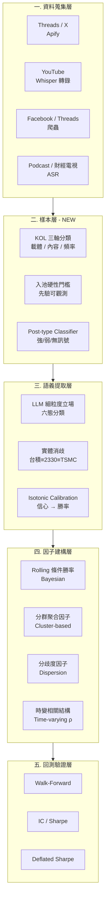

# 評審簡報大綱 v2 — 多 KOL 跨平台量化情緒因子系統

> **用途**：本文件為 Claude Design / 投影片生成工具的輸入素材
> **講者**：施博瀚（Stan Shih）／ 師大資工系
> **場合**：專題評審口頭報告（7 分鐘 + Q&A）
> **評分權重**：問題描述 20% / 方法與創新 60% / 實驗有效性 20%
> **語言**：繁體中文
> **版本**：v2（2026-04-24 修訂）
>
> **v2 主要變更（相對於 v1）**：
> 1. 新增 **KOL 三軸分類法（載體/內容/頻率）** 作為樣本層方法論
> 2. 新增 **可重現樣本選取規則** 為 Contribution 1（回應「為什麼是這些 KOL」的學術挑戰）
> 3. 新增 **Post-type classifier** 作為 Layer 2 前置處理（處理發文不固定問題）
> 4. Slide 4 因子層：以 **Cluster-based aggregation + Dispersion factor** 取代 v1 的「共識聚合因子」
> 5. 新增 **時變相關結構分析** 為 Contribution 5（取代 v1 的獨立多模態 contribution，多模態降為 Layer 1 實作細節）
> 6. Sharpe 目標由 1.5+ 下修為 **1.0–1.2（Stretch 1.5）**，對齊實證文獻
> 7. Slide 3 挑戰表新增「**KOL 異質性**」一行
> 8. Q&A 新增 Q8（樣本選取答辯），Q6 答案同步下修

---

## 〇、設計指引（給簡報生成工具）

- **頁數**：7 張投影片（含 Title），平均每頁 60 秒
- **風格**：學術簡報，深色背景，重點數字大字級突出
- **字級**：標題 ≥ 36pt，內文 ≥ 24pt
- **每頁限制**：最多 5 個 bullet
- **必備視覺**：第 4 頁系統架構圖、第 5 頁五個 contribution 對照表、第 6 頁實驗設計
- **配色**：主色 #1E3A8A（深藍）、強調 #F59E0B（橘）、背景 #0F172A
- **避免**：所有 emoji

---

# 部分 A：投影片內容

---

## Slide 1：Title

**標題**：多 KOL 跨平台量化情緒因子系統

**副標**：A Multi-KOL Cross-Platform Sentiment Factor System for Taiwan Equity Markets

**講者資訊**：
- 施博瀚 / 師大資工系
- 指導教授：[填入]
- 2026 / [月份]

**視覺**：
- 多個頭像剪影（代表 KOL）→ 訊號箭頭 → 因子矩陣 → Sharpe 曲線
- 帶台股 + Threads/X/YouTube logo（極淡）

---

## Slide 2：研究問題（佔 20%）

**標題**：散戶意見領袖的影響力，從未被系統性量化

**核心觀察**：
- 台灣財經 KOL 在 Threads / X / YouTube 上的言論，**直接影響數十萬散戶**
- 散戶群體行為早於市場定價，存在**短暫可交易視窗**
- **目前無任何系統**將此影響力轉化為可回測的量化因子

**現有研究的缺口**：

| 既有研究 | 缺口 |
|---|---|
| Twitter 整體情緒 → 指數預測 | 太粗糙，沒區分 KOL 個體差異 |
| Reddit r/WSB → 個股動量 | 英文市場，中文財經 KOL 幾乎無人研究 |
| 財經新聞 NLP | 媒體是落後指標，KOL 更即時 |
| banini-tracker（開源） | 只追蹤一個 KOL，無因子化、無回測 |

**核心命題**：
> KOL 的**預測品質本身就是一個可量化的 latent variable**。
> 透過「**可重現樣本選取 + 動態信任度 + 時變相關結構**」三層方法論，
> 可將分散、異質的 KOL 言論轉為具 IC 的量化因子。

---

## Slide 3：價值與挑戰（接續 20%）

**標題**：為什麼這是個值得做的問題

**價值（左半邊）**：
- **學術**：中文財經 NLP × 量化因子 × 動態信任度 — 三者交集是空白地帶
- **產業**：台灣量化基金正在追求「另類數據因子」，KOL 是被忽視的金礦
- **方法論**：可遷移至其他「噪音資料 → 結構化訊號」的問題（醫療、政治）

**挑戰（右半邊）**：

| 挑戰 | 具體問題 |
|---|---|
| **樣本選取** | 為什麼是這 N 個 KOL？如何避免 look-ahead bias 挑人？ |
| **異質性** | 文字 / 影片 / 直播，頻率與細膩度差異大，不能一視同仁 |
| **NLP** | 中文 KOL 用語混雜（俚語、emoji、暗示），細粒度立場提取難 |
| **校準** | LLM 給的「信心 0.8」實際勝率是 80% 嗎？需 calibration |
| **相關結構** | 多 KOL 在趨勢盤高度同質化，如何抽出獨立訊號？ |
| **資料完整性** | Point-in-time 嚴格性（不能用未來資訊回測過去） |

---

## Slide 4：系統架構（方法論 60% — 主菜 1）

**標題**：五層 Pipeline（以樣本層 & 相關結構層為新增創新）

**Mermaid 架構圖**：

**技術選型**：
- 爬蟲：Apify + 自寫 fallback（Threads / X 反爬日益嚴格）
- 語音：Whisper large-v3-turbo（已實作於 Track A，文字影片皆用）
- LLM：Claude / GPT 雙模型 cross-check，Haiku 做 post-type 粗篩
- 資料庫：SQLite + Parquet（point-in-time bitemporal schema）
- 回測：vectorbt + 自寫 walk-forward 框架
- 分群：scipy hierarchical clustering + 滾動視窗相關矩陣

---

## Slide 5：創新性 — 五個 Personal Contribution（60% — 主菜 2）

**標題**：五個與既有研究的差異化貢獻

| 維度 | 既有做法 | **本研究** |
|---|---|---|
| **樣本選取** | 主觀挑 top-N | **先驗可重現規則 + 三軸分類** |
| **追蹤對象** | 單一 KOL | **多 KOL 跨平台、跨載體聚合** |
| **立場提取** | 二元情感 | **六態細粒度 + post-type 過濾** |
| **信任度** | 靜態評估 | **Rolling 動態 + Bayesian 校準** |
| **因子結構** | 單層加權 | **分群聚合 + 分歧度 + 時變相關** |
| **回測嚴謹性** | 簡單看勝率 | **Walk-Forward + IC 衰減 + Deflated Sharpe** |

**五個 Personal Contribution**：

1. **可重現樣本選取規則（NEW）**
   - **三軸分類**：載體（文字/影片/直播）× 內容（交易型/分析型/混合）× 頻率（日/週/月頻）
   - **入池門檻**：發文歷史 ≥ 18 個月、強訊號貼文 ≥ 8 篇/月、HHI ≤ 0.3
   - **Post-type classifier**：分流「強/弱/無」訊號，避免雜訊污染
   - **回應「為什麼是這些 KOL」的學術死結，取代主觀挑 top-N**

2. **動態 Bayesian 信任度框架**
   - 用 Beta-Binomial 共軛先驗追蹤每位 KOL 的條件勝率
   - 條件變數：市場狀態 / 標的板塊 / 預測時間框 / **KOL 類型**
   - **這是現有任何 KOL 追蹤系統沒做的**

3. **LLM 信心校準 (Calibration)**
   - LLM 自評信心 → 經 isotonic regression 校準到實際勝率
   - 產出 reliability diagram 作為驗證
   - **少見地把 calibration literature 引入 NLP × 金融**

4. **Point-in-Time Bitemporal Schema**
   - 嚴格區分「事件時間」與「系統知曉時間」
   - 確保回測 100% 無 look-ahead bias
   - **多數開源量化研究的硬傷，本系統從資料層解決**

5. **時變相關結構 & 分歧度因子（NEW）**
   - 滾動窗口計算 N×N KOL 訊號相關矩陣 → hierarchical clustering
   - **Cluster-based aggregation**：每群內聚合 → 群間作為低相關子因子
   - **Dispersion factor**：KOL 意見分散度本身作為獨立訊號
   - **回應「趨勢盤時 KOL 意見同質化」的因子退化問題**

> 註：多模態（文字 + 語音）作為 Layer 1 資料來源的實作細節，不再獨立列為 contribution。

---

## Slide 6：實驗設計（佔 20%）

**標題**：三層實驗驗證有效性

### 層 1：NLP 提取品質
- **資料**：200 筆人工標註的 KOL 貼文（自建）
- **量測**：立場分類 F1、實體消歧 accuracy、LLM 信心 calibration error、post-type classifier accuracy
- **預期**：F1 ≥ 0.75，calibration ECE ≤ 0.05，post-type accuracy ≥ 0.85

### 層 2：因子有效性（**v2 擴充**）
- **資料**：**入池門檻下所有符合的 KOL**（預估 10–15 位）× 12 個月 × 30 個台股標的
- **量測**：
  - 單 KOL rolling IC / 聚合因子 IC / IC 衰減曲線
  - **時變相關性熱圖**（滾動窗口，2–6 個月）
  - **分歧度因子獨立 IC**
  - **分群後各子因子 IC**
- **預期**：單 KOL IC ≥ 0.03、分群聚合 IC ≥ 0.05（統計顯著）、分歧度因子 IC ≥ 0.04

### 層 3：策略有效性（**v2 修訂**）
- **資料**：組合多 KOL 因子 + Alpha101，跑 walk-forward 回測
- **量測**：
  - Out-of-sample Sharpe
  - Deflated Sharpe（扣除 multiple-testing bias 後）
  - **KOL 因子對 Alpha101 的 incremental IC**
  - 最大回撤、Calmar ratio
- **預期**：**OOS Sharpe 1.0–1.2（Stretch Goal 1.5）**，Deflated Sharpe ≥ 0.8

**對照組（v2 修訂）**：
| 系統 | 預期 OOS Sharpe |
|---|---|
| Buy-and-Hold 0050 | ~0.5 |
| 純 Alpha101 因子 | ~0.8 |
| 單一 KOL 跟隨 | ~0.6 |
| **本系統（KOL + Alpha101）** | **目標 1.0–1.2 ，Stretch 1.5** |

**核心成功指標（v2 新增）**：
> 真正要打贏的不是 Sharpe 絕對值，而是 **KOL 因子對 Alpha101 的 incremental alpha**。
> 若純 Alpha101 Sharpe = 0.8、加入 KOL 因子後 = 1.1，則證明 KOL 因子有 ≥ 0.3 的增量貢獻，已是可發表結果。

---

## Slide 7：時程與結語

**標題**：兩學期里程碑 + 預期貢獻

**現有進度（已完成）**：
- Facebook / Podcast 資料管道
- Whisper large-v3-turbo 中文轉錄
- LLM extract POC
- 台股 + 美股價格快取系統

**第一學期（深化）**：
- 月 1：**KOL 三軸分類 + 入池規則定義 + post-type classifier**
- 月 2：擴張至 10+ KOL × 4 平台、bitemporal DB schema
- 月 3：細粒度立場提取 + LLM calibration
- 月 4：Bayesian 動態信任度 + 第一份 IC 報告

**第二學期（整合 + 驗證）**：
- 月 5：**時變相關結構 + 分群聚合 + 分歧度因子**
- 月 6：Walk-forward + Deflated Sharpe 框架
- 月 7：與 Alpha101 整合策略，量測 incremental IC
- 月 8：完整實驗 + 報告 + Demo Web App

**預期貢獻**：
1. **資料面**：首個系統性追蹤的中文財經 KOL 量化資料集
2. **方法面**：可重現樣本選取 + LLM calibration + Bayesian 信任度 + 時變相關結構 的工業實踐
3. **實證面**：KOL 量化因子對 Alpha101 增量 IC 的首份學術級驗證

**結語**：
> 「KOL 的話本來只是噪音，但透過三層方法論——**先驗樣本選取、動態信任度校準、時變相關結構** ——可以變成結構化的量化訊號。本系統把這個轉換工程化、嚴謹化，並誠實回答『多少增量 alpha』。」

---

# 部分 B：講者腳本（嚴格 7 分鐘 = 420 秒）

| 時間 | 投影片 | 講稿 |
|---|---|---|
| **0:00–0:30** | Slide 1 | 「各位老師好，我是師大資工系的施博瀚。今天報告的專題是『多 KOL 跨平台量化情緒因子系統』。簡單說，就是把網紅講的話，透過系統化方法論，轉成可以下單的量化訊號。」 |
| **0:30–1:50** | Slide 2 問題 | 「先講為什麼這是問題。台灣財經 KOL 在 Threads、X、YouTube 影響數十萬散戶，散戶行為早於市場定價，存在短暫可交易視窗。但目前沒有任何系統把這影響力量化。Twitter 整體情緒研究太粗；Reddit 研究是英文市場；最接近的 banini-tracker 只追一個人、沒有因子化、沒有回測。我的核心命題是：**KOL 的預測品質本身就是一個可量化的 latent variable**，但要能用，必須同時解決三件事——**可重現樣本選取、動態信任度、時變相關結構**。」 |
| **1:50–2:50** | Slide 3 價值/挑戰 | 「價值有三層：學術上，中文 NLP × 量化因子 × 動態信任度，三者交集是空白；產業上，量化基金都在追另類數據；方法論可遷移到其他噪音資料問題。挑戰有六個：**樣本選取**（為什麼是這些 KOL）、**異質性**（文字 vs 影片差異）、細粒度立場提取、LLM 校準、**相關結構**（趨勢盤意見同質化）、以及 point-in-time 資料完整性。前兩項與第五項是 v1 版本沒解決、v2 新補上的。」 |
| **2:50–4:30** | Slide 4 架構 | 「系統五層 pipeline。Layer 1 資料蒐集跨四種來源，YouTube 與財經節目都用 Whisper。**Layer 2 樣本層是新增的**，做 KOL 三軸分類、入池門檻、post-type 分流，這是方法論核心之一。Layer 3 語義提取做細粒度立場、實體消歧、信心校準。**Layer 4 因子層從 v1 的共識聚合改成分群聚合 + 分歧度 + 時變相關**，避免趨勢盤失效。Layer 5 回測用 walk-forward + Deflated Sharpe。Whisper、LLM extract、價格快取——**這些都已實作完成**，不是 propose 而是已驗證可行。」 |
| **4:30–5:50** | Slide 5 創新 | 「跟既有研究差異有五個 contribution。第一，**可重現樣本選取規則**——用三軸分類（載體、內容、頻率）加上先驗可觀測門檻，所有符合的 KOL 全收，不主觀挑 top-N，這直接回應審查委員最可能問的『為什麼是這些 KOL』。第二，**動態 Bayesian 信任度**，用 Beta-Binomial 追蹤條件勝率。第三，**LLM 信心校準**，把 isotonic regression 引入金融 NLP。第四，**Point-in-time bitemporal schema**，從資料層杜絕 look-ahead。第五，**時變相關結構 + 分歧度因子**——用滾動相關矩陣做階層聚類，取代單純共識聚合，並把意見分散度本身作為獨立 signal。」 |
| **5:50–6:40** | Slide 6 實驗 | 「實驗三層。層 1 測 NLP 品質，200 筆標註，看 F1、calibration、post-type 準確率。層 2 測因子，入池所有 KOL × 12 月 × 30 標的，看單 KOL IC、分群聚合 IC、**時變相關熱圖**、分歧度獨立 IC。層 3 測策略，組合 KOL + Alpha101 walk-forward，**核心指標是 incremental IC**——我不追求絕對 Sharpe 1.5，而是證明 KOL 因子對 Alpha101 有 ≥ 0.3 的增量貢獻，目標 OOS Sharpe 1.0 到 1.2，stretch 1.5。Deflated Sharpe ≥ 0.8。」 |
| **6:40–7:00** | Slide 7 時程 | 「兩個學期。第一學期完成樣本層、擴張至 10 位 KOL、calibration 與 Bayesian；第二學期完成相關結構分析、多模態整合、Alpha101 組合與增量驗證。預期交付資料集、方法論論文、實證報告。謝謝老師。」 |

**節奏要點**：
- 1:50 強調「三件事要同時解決」—— v2 方法論總綱
- 2:50 強調「v1 沒解決、v2 新補上的」—— 顯示思考迭代
- 4:30 強調「Layer 2 樣本層是新增的」—— 最容易被攻擊的點反而是 contribution
- 5:50 強調「所有符合的 KOL 全收，不主觀挑」—— 堵住教授最常問的問題
- 6:40 強調「不追求絕對 Sharpe，追求 incremental IC」—— 誠實且嚴謹

---

# 部分 C：視覺素材建議

## C.1 Slide 1
- KOL 頭像剪影 → 訊號流 → 因子矩陣 → Sharpe 曲線（從左到右）
- 標題 48pt

## C.2 Slide 2 數字
- 「**0**」字級 96pt 橘色，旁邊小字「現有可用台股 KOL 因子系統」
- 對照「**14M**」（台灣 Threads 用戶數估計）

## C.3 Slide 4 架構
- Mermaid 直接 render
- 五層用五種色帶分隔（資料藍 / 樣本黃 / NLP 紫 / 因子綠 / 回測橘）
- **Layer 2 樣本層用 NEW 標籤**

## C.4 Slide 5 對照表
- 6 列對照，本研究欄位用橘色 highlight
- Contribution 1 和 5 用 NEW 標籤

## C.5 Slide 6 實驗矩陣
- 三張並排卡片，每張顯示 資料 / 量測 / 預期
- 層 2 卡片特別放相關性熱圖的示意圖

---

# 部分 D：Q&A 防禦準備

## Q1：「KOL 言論本來就是雜音，你怎麼證明這真的有預測力？」
**答**：這正是實驗層 2 要回答的。我會用 IC（Information Coefficient）做統計檢定。如果經過 calibration 後的聚合因子 IC 顯著高於 0，且 Deflated Sharpe 扣除 multiple-testing bias 後仍 > 0.8，就證明有效。**核心指標是 incremental IC**——KOL 因子對 Alpha101 的增量貢獻。如果結果是負的，本身也是一個可發表的 negative finding。

## Q2：「LLM 提取容易出錯，你的系統不就建在沙上？」
**答**：這是為什麼我把 calibration 列為主要 contribution 之一。LLM 必然會錯，關鍵是它「錯得有規律」。透過 isotonic regression 把 LLM 自評信心校準到實際勝率，把錯誤量化進系統，而非假裝它不存在。reliability diagram 會作為驗證輸出。另外 post-type classifier 會先把「心情閒聊」類貼文剔除，不讓雜訊污染管線。

## Q3：「banini-tracker 已經做了，你只是擴大規模？」
**答**：架構上是 inspired by，但有五個本質差異：(1) 多 KOL 跨平台 vs 單一 KOL 單平台；(2) 量化因子化框架 vs 純通知；(3) **可重現樣本選取規則 vs 主觀選人**；(4) 動態 Bayesian 信任度 vs 靜態信任；(5) **時變相關結構 + 分歧度因子 vs 單一訊號**；(6) 嚴謹回測 + Deflated Sharpe vs 無回測。簡言之，banini-tracker 是「個人工具」，本系統是「研究框架」。

## Q4：「為什麼用 LLM 不用傳統 NLP 模型？LLM 太貴又慢」
**答**：傳統 NLP 模型需要數萬筆標註資料 fine-tune，中文財經立場提取沒有現成資料集。LLM 可以 zero/few-shot 達到可用品質。成本用混合策略：post-type 粗篩用 Haiku，細粒度立場提取才用 Sonnet。實測單篇成本 < $0.001。

## Q5：「7 分鐘的講法你做得完嗎？」
**答**：已有實作基礎（Facebook 抓取、Whisper 轉錄、LLM extract 都跑通）。第一學期目標是「10 位 KOL 的 IC 報告」，第二學期才做相關結構與整合。Plan B fallback 是縮減為 5 KOL + 純文字模態。

## Q6：「Sharpe 1.0–1.2 不夠高吧？量化基金都要 2.0 以上」
**答**：這是**研究專題**不是對沖基金產品，核心指標不是絕對 Sharpe 而是**incremental IC**。實證文獻中，另類數據因子對傳統 Alpha101 的 incremental Sharpe 典型在 0.2–0.4 區間。**我的目標是證明 KOL 因子能為 Alpha101 的 0.8 Sharpe 再加 0.2–0.4**，達 1.0–1.2。Stretch Goal 才是 1.5。Deflated Sharpe 的引入正是要避免 inflated 數字騙到自己。誠實報告「KOL 因子貢獻 0.3 Sharpe」比自欺「1.5 Sharpe」更有研究價值。

## Q7：「跟你另一個分散式平台專題的關係？」
**答**：兩個獨立專題，但有自然鬆耦合接點。本系統產出的 KOL 因子，可以作為分散式平台上的「策略池」之一進行大規模參數搜尋。但本系統不依賴分散式平台才能運作，反之亦然。兩者可獨立交付。

## Q8：「為什麼是這 10 位 KOL 而不是其他？你怎麼排除倖存者偏差？」（**NEW**）
**答**：這是我 contribution 1 直接回應的問題。我不用歷史績效挑人，而用**三個先驗、可觀測、獨立於未來資訊**的標準：(1) 載體 × 內容 × 頻率的三軸分類覆蓋；(2) 入池門檻（發文歷史 ≥ 18 個月、強訊號貼文 ≥ 8 篇/月、標的集中度 HHI ≤ 0.3）；(3) 所有通過門檻的 KOL 全部收進來，不挑。Bayesian 框架會自動學出哪些人準，這個「學習」過程用 walk-forward 切分 in-sample / out-of-sample，避免 look-ahead。**所以我不是挑了 10 個『會贏的』，而是把所有符合客觀門檻的人全部放進來，讓資料自己說話。**

## Q9：「KOL 們在趨勢盤會講一樣的東西，相關性很高，你的多因子還有意義嗎？」（**NEW**）
**答**：這正是 contribution 5 要解的問題。我不假設 KOL 之間相關性恆定，而是用**滾動窗口相關矩陣**觀察它隨市場狀態變化。做法有三層：(1) hierarchical clustering 把高相關 KOL 分到同群，群內聚合成一個子因子，群間自動低相關；(2) **分歧度因子**本身作為獨立訊號——KOL 意見高度一致時市場常已 price in，分歧時反而是機會；(3) 在實驗層 2 產出時變相關熱圖，明確展示「什麼市況下因子退化、什麼市況下有效」。這把傳統因子研究的靜態相關假設打破，是獨立可發表的方法論貢獻。

---

# 部分 E：技術參考

## E.1 關鍵文獻
- Bollen, J. et al. (2011). "Twitter mood predicts the stock market." Journal of Computational Science.
- Niculescu-Mizil, A. & Caruana, R. (2005). "Predicting Good Probabilities With Supervised Learning." ICML.（calibration 經典）
- Bailey, D. H. & Lopez de Prado, M. (2014). "The Deflated Sharpe Ratio." Journal of Portfolio Management.
- Snowberg, E. & Wolfers, J. (2010). "Explaining the Favorite-Long Shot Bias." Journal of Political Economy.
- Kakushadze, Z. (2016). "101 Formulaic Alphas." Wilmott.
- **Brown, G. W. & Cliff, M. T. (2004). "Investor sentiment and the near-term stock market." Journal of Empirical Finance.**（分歧度因子 motivation）
- **Lopez de Prado, M. (2018). "Advances in Financial Machine Learning." Wiley.**（時變相關 + walk-forward 方法論）

## E.2 既有系統對照
- **banini-tracker** — 單一 KOL 單平台通知，本研究的 inspiration
- **StockTwits / Reddit 情緒** — 英文市場，粗粒度
- **天風證券 / 國泰 KOL 追蹤** — 內部研究，無公開方法

## E.3 技術棧
| 元件 | 選型 | 理由 |
|---|---|---|
| 爬蟲 | Apify + 自寫 fallback | 反爬機制日益嚴，需多源 |
| 語音轉錄 | Whisper large-v3-turbo (CTranslate2) | 中文表現 SOTA，已驗證 |
| LLM | Claude Sonnet + Haiku 混合 | 成本/品質平衡，Haiku 做 post-type 粗篩 |
| 資料庫 | SQLite + Parquet (bitemporal) | 輕量 + point-in-time 嚴格 |
| 回測 | vectorbt + 自寫 walk-forward | 向量化效率 + 客製需求 |
| 校準 | scikit-learn IsotonicRegression | 標準工具 |
| **分群** | **scipy hierarchical clustering + 滾動相關矩陣** | **時變結構分析** |
| 視覺化 | Plotly + Streamlit | 互動式 demo |

---

# 部分 F：給簡報生成工具的使用說明

請依照以下順序生成 7 張投影片：

1. **直接使用「部分 A」每個 Slide 段落作為對應投影片內容**
2. **「部分 B」講者腳本** 塞到每張投影片的 speaker notes
3. **「部分 C」視覺建議** 用來決定 layout 與圖表
4. **「部分 D」Q&A** 附在最後一張之後當備用 slides（不算在 7 張內）
5. **「部分 E」技術參考** 作為 appendix slides

**重要約束**：
- 嚴禁加任何投影片以外的內容
- 嚴禁修改或創新內容，完全照本文件做
- 如有疑慮先停下來問，不要自行發揮

---

**END OF DOCUMENT (v2)**
