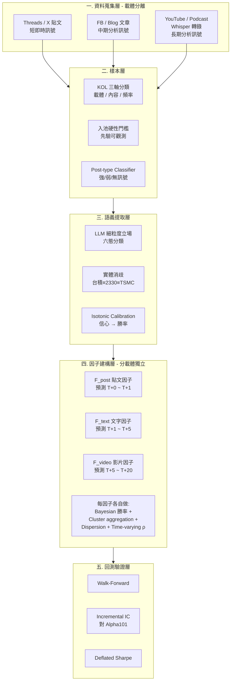

# 評審簡報大綱 v3 — 多 KOL 跨平台量化情緒因子系統

> **用途**:本文件為 Claude Design / 投影片生成工具的輸入素材
> **講者**:施博瀚(Stan Shih)／ 師大資工系
> **場合**:專題評審口頭報告(7 分鐘 + Q&A)
> **評分權重**:問題描述 20% / 方法與創新 60% / 實驗有效性 20%
> **語言**:繁體中文
> **版本**:v3(2026-04-24 修訂)
>
> **v3 主要變更(相對於 v2)**:
> 1. 核心命題改寫:從「latent variable」改為「**KOL 作為散戶行為樣本,其系統性偏誤是 alpha 來源**」
> 2. 新增「**散戶佔台股成交量 ~50%**」作為台股特殊性的學術支撐
> 3. 載體處理方案明確化:**分載體獨立因子(方案 A)+ 時間尺度錯位預測(方案 B)**
> 4. 實驗設計改為 **Phase 1/2/3 階段性**(單標的 → 五檔權值 → 三十檔跨板塊)
> 5. Alpha 目標雙軌化:**Baseline 1.0–1.2 / Stretch 1.5**,核心指標 incremental Sharpe
> 6. Slide 6 對照組改用 **incremental Sharpe 為主指標**
> 7. 時程配合 Phase 化調整,載體按「文字 → 影片」分階段加入
> 8. Q&A 新增 Q10(為什麼載體分開不融合)、Q11(為什麼從台積電單標的開始)

---

## 〇、設計指引(給簡報生成工具)

- **頁數**:7 張投影片(含 Title),平均每頁 60 秒
- **風格**:學術簡報,深色背景,重點數字大字級突出
- **字級**:標題 ≥ 36pt,內文 ≥ 24pt
- **每頁限制**:最多 5 個 bullet
- **必備視覺**:第 4 頁系統架構圖、第 5 頁五個 contribution 對照表、第 6 頁實驗設計
- **配色**:主色 #1E3A8A(深藍)、強調 #F59E0B(橘)、背景 #0F172A
- **避免**:所有 emoji

---

# 部分 A:投影片內容

---

## Slide 1:Title

**標題**:多 KOL 跨平台量化情緒因子系統

**副標**:A Multi-KOL Cross-Platform Sentiment Factor System for Taiwan Equity Markets

**講者資訊**:
- 施博瀚 / 師大資工系
- 指導教授:[填入]
- 2026 / [月份]

**視覺**:
- 多個頭像剪影(代表 KOL)→ 訊號箭頭 → 因子矩陣 → Sharpe 曲線
- 帶台股 + Threads/X/YouTube logo(極淡)

---

## Slide 2:研究問題(佔 20%)

**標題**:散戶意見領袖的行為,從未被系統性量化

**核心觀察**:
- 台灣股市**散戶佔成交量約 50%**(對比美股 ~20%),散戶行為對定價的影響顯著
- 財經 KOL 在 Threads / X / YouTube 上的言論,是**散戶行為的濃縮樣本**
- 目前無任何系統將此樣本結構化為可回測的量化因子

**現有研究的缺口**:

| 既有研究 | 缺口 |
|---|---|
| Twitter 整體情緒 → 指數預測 | 太粗糙,沒區分 KOL 個體差異 |
| Reddit r/WSB → 個股動量 | 英文市場,中文財經 KOL 幾乎無人研究 |
| 財經新聞 NLP | 媒體是落後指標,KOL 更即時 |
| banini-tracker(開源) | 只追蹤一個 KOL,無因子化、無回測 |

**核心命題**:
> **KOL 作為散戶行為樣本,其預測品質與系統性偏誤本身是可量化的 alpha 來源**。
> 透過「**可重現樣本選取 + 動態信任度 + 時變相關結構**」三層方法論,
> 可將分散、異質的 KOL 言論轉為具 IC 的量化因子。

---

## Slide 3:價值與挑戰(接續 20%)

**標題**:為什麼這是個值得做的問題

**價值(左半邊)**:
- **學術**:中文財經 NLP × 量化因子 × 動態信任度 — 三者交集是空白地帶
- **市場特性**:台股散戶比重 ~50%,KOL 作為散戶行為樣本在台股最有解釋力
- **方法論**:可遷移至其他「噪音資料 → 結構化訊號」的問題(醫療、政治)

**挑戰(右半邊)**:

| 挑戰 | 具體問題 |
|---|---|
| **樣本選取** | 為什麼是這 N 個 KOL?如何避免 look-ahead bias 挑人? |
| **載體異質性** | 文字 / 影片 / 貼文,頻率與細膩度差異大,不能一視同仁 |
| **NLP** | 中文 KOL 用語混雜(俚語、emoji、暗示),細粒度立場提取難 |
| **校準** | LLM 給的「信心 0.8」實際勝率是 80% 嗎?需 calibration |
| **相關結構** | 多 KOL 在趨勢盤高度同質化,如何抽出獨立訊號? |
| **資料完整性** | Point-in-time 嚴格性(不能用未來資訊回測過去) |

---

## Slide 4:系統架構(方法論 60% — 主菜 1)

**標題**:五層 Pipeline — 載體分離建模,時間尺度錯位預測

**Mermaid 架構圖**:

**兩個架構決定**:

1. **載體獨立因子(不融合)**:三種載體(貼文/文字/影片)各自產出獨立因子,在回測層用 portfolio 方式組合,不事前混合。**理由**:若某一載體失效,能明確定位責任,且避免高相關載體互相污染訊號。

2. **時間尺度錯位預測**:不同載體匹配不同預測時間框,反映資訊擴散速度差異。
   - 貼文(秒~分鐘發布密度)→ 預測 T+0 ~ T+1 日報酬
   - 文字(小時級發布)→ 預測 T+1 ~ T+5 日報酬
   - 影片(日級發布,需消化時間)→ 預測 T+5 ~ T+20 日報酬

**技術選型**:
- 爬蟲:Apify + 自寫 fallback(Threads / X 反爬日益嚴格)
- 語音:Whisper large-v3-turbo(已實作於 Track A)
- LLM:Claude / GPT 雙模型 cross-check,Haiku 做 post-type 粗篩
- 資料庫:SQLite + Parquet(point-in-time bitemporal schema)
- 回測:vectorbt + 自寫 walk-forward 框架
- 分群:scipy hierarchical clustering + 滾動視窗相關矩陣

---

## Slide 5:創新性 — 五個 Personal Contribution(60% — 主菜 2)

**標題**:五個與既有研究的差異化貢獻

| 維度 | 既有做法 | **本研究** |
|---|---|---|
| **樣本選取** | 主觀挑 top-N | **先驗可重現規則 + 三軸分類** |
| **追蹤對象** | 單一 KOL | **多 KOL 跨平台、跨載體聚合** |
| **載體處理** | 一視同仁或只做文字 | **分載體獨立建模 + 時間尺度錯位** |
| **立場提取** | 二元情感 | **六態細粒度 + post-type 過濾** |
| **信任度** | 靜態評估 | **Rolling 動態 + Bayesian 校準** |
| **因子結構** | 單層加權 | **分群聚合 + 分歧度 + 時變相關** |
| **回測嚴謹性** | 簡單看勝率 | **Walk-Forward + incremental IC + Deflated Sharpe** |

**五個 Personal Contribution**:

1. **可重現樣本選取規則**
   - **三軸分類**:載體(文字/影片/直播)× 內容(交易型/分析型/混合)× 頻率(日/週/月頻)
   - **入池門檻**:發文歷史 ≥ 18 個月、強訊號貼文 ≥ 8 篇/月、HHI ≤ 0.3
   - **Population-based**:任何符合可觀測門檻的 KOL 全收,不主觀挑 top-N
   - **回應「為什麼是這些 KOL」的學術死結**

2. **載體分離建模 + 時間尺度錯位**
   - 三種載體各自獨立建模,避免高相關載體互相污染
   - 預測時間框對齊載體的資訊擴散速度(貼文短期、影片中長期)
   - **現有研究多數把所有文本 pooling 處理,忽略載體之間的時間異質性**

3. **動態 Bayesian 信任度框架**
   - 用 Beta-Binomial 共軛先驗追蹤每位 KOL 的條件勝率
   - 條件變數:市場狀態 / 標的板塊 / 預測時間框 / KOL 類型
   - **這是現有任何 KOL 追蹤系統沒做的**

4. **LLM 信心校準 (Calibration)**
   - LLM 自評信心 → 經 isotonic regression 校準到實際勝率
   - 產出 reliability diagram 作為驗證
   - **少見地把 calibration literature 引入 NLP × 金融**

5. **時變相關結構 & 分歧度因子**
   - 滾動窗口計算 N×N KOL 訊號相關矩陣 → hierarchical clustering
   - **Cluster-based aggregation**:每群內聚合 → 群間作為低相關子因子
   - **Dispersion factor**:KOL 意見分散度本身作為獨立訊號
   - **回應「趨勢盤時 KOL 意見同質化」的因子退化問題**

> 註:Point-in-time bitemporal schema 作為資料層基礎設施,不獨立列為 contribution,但貫穿所有 Layer。

---

## Slide 6:實驗設計(佔 20%)

**標題**:三層驗證 × 三階段標的擴張

### 層 1:NLP 提取品質
- **資料**:200 筆人工標註的 KOL 貼文(自建)
- **量測**:立場分類 F1、實體消歧 accuracy、LLM 信心 calibration error、post-type classifier accuracy
- **預期**:F1 ≥ 0.75,calibration ECE ≤ 0.05,post-type accuracy ≥ 0.85

### 層 2:因子有效性(**三階段標的擴張**)

| Phase | 標的範圍 | 目的 | 量測重點 |
|---|---|---|---|
| **Phase 1** | 僅台積電(2330) | PoC,驗證單標的訊號存在 | 單 KOL rolling IC、三載體各自 IC |
| **Phase 2** | 權值股前 5(台積、鴻海、聯發科、台達電、國泰金) | 跨板塊驗證、跨 KOL 比較 | 分群聚合 IC、分歧度因子 IC、時變相關熱圖 |
| **Phase 3** | 30 檔跨板塊(半導體/電子/金融/傳產/生技) | 一般化、incremental alpha 驗證 | 對 Alpha101 incremental IC |

**Phase 選取標準(皆為可觀測,無倖存者偏差)**:
- 0050 指數權重前 N
- KOL 提及頻率歷史累計 ≥ 10 次
- 日均成交值 ≥ 10 億(流動性門檻)

**預期**:
- Phase 1:三載體各自 IC ≥ 0.02,至少一個 ≥ 0.04
- Phase 2:分群聚合 IC ≥ 0.05、分歧度因子 IC ≥ 0.04
- Phase 3:對 Alpha101 incremental IC ≥ 0.03

### 層 3:策略有效性(**incremental alpha 雙軌目標**)

- **資料**:Phase 3 完成後,組合三載體獨立因子 + Alpha101,跑 walk-forward 回測
- **量測**:
  - Out-of-sample Sharpe
  - Deflated Sharpe(扣除 multiple-testing bias)
  - **KOL 因子對 Alpha101 的 incremental Sharpe**
  - 最大回撤、Calmar ratio

**目標雙軌**:

| 指標 | Baseline(對外承諾) | Stretch(內部目標) |
|---|---|---|
| OOS Sharpe | 1.0 – 1.2 | 1.5 |
| Deflated Sharpe | ≥ 0.8 | ≥ 1.2 |
| Incremental Sharpe vs Alpha101 | ≥ 0.3 | ≥ 0.5 |
| Incremental IC | ≥ 0.03 | ≥ 0.05 |

**對照組(v3 以 incremental Sharpe 為主指標)**:
| 系統 | 預期 Incremental Sharpe vs Alpha101 |
|---|---|
| Buy-and-Hold 0050 | N/A(非因子基準) |
| 純 Alpha101 因子 | 0(對照基準,假設 Sharpe ~0.8) |
| 單一 KOL 跟隨 | ~0.05 |
| 本系統 KOL 因子組(貼文+文字+影片) | **Baseline ≥ 0.3 / Stretch ≥ 0.5** |

**核心成功指標**:
> 不追求絕對 Sharpe 數字,而是證明 **KOL 因子對 Alpha101 的 incremental Sharpe ≥ 0.3**。
> 若純 Alpha101 Sharpe = 0.8,加入 KOL 因子後 = 1.1,即達 Baseline。

---

## Slide 7:時程與結語

**標題**:兩學期里程碑 + 預期貢獻

**現有進度(已完成)**:
- Facebook / Podcast 資料管道
- Whisper large-v3-turbo 中文轉錄
- LLM extract POC
- 台股 + 美股價格快取系統

**第一學期(Phase 1 + Phase 2,單標的 → 五檔)**:
- 月 1:KOL 三軸分類 + 入池規則定義 + post-type classifier
- 月 2:**Phase 1 啟動** — 台積電單標的 + 貼文載體 + 文字載體(先不含影片)
- 月 3:細粒度立場提取 + LLM calibration + 貼文/文字因子 IC 報告
- 月 4:**Phase 2 啟動** — 擴張至五檔權值股 + Bayesian 動態信任度

**第二學期(Phase 3,加入影片 + 整合驗證)**:
- 月 5:**影片載體加入** — Whisper 轉錄 + 影片因子獨立 IC
- 月 6:時變相關結構 + 分群聚合 + 分歧度因子(三載體共通層)
- 月 7:**Phase 3 啟動** — 30 檔跨板塊 + Walk-forward + Deflated Sharpe 框架
- 月 8:與 Alpha101 整合 + incremental Sharpe 量測 + Demo Web App

**預期貢獻**:
1. **資料面**:首個系統性追蹤的中文財經 KOL 量化資料集(跨三載體)
2. **方法面**:載體分離建模 + 時間尺度錯位 + LLM calibration + Bayesian 信任度 + 時變相關結構 的工業實踐
3. **實證面**:KOL 量化因子對 Alpha101 增量 Sharpe 的首份學術級驗證

**結語**:
> 「KOL 的話本來只是散戶情緒的噪音樣本,但透過五層 pipeline——**載體分離、時間錯位、動態校準、相關結構分析** ——可以轉為結構化的量化訊號。本系統把這個轉換工程化、嚴謹化,核心指標鎖定在 incremental Sharpe,誠實回答『KOL 因子對既有 alpha stack 貢獻多少』。」

---

# 部分 B:講者腳本(嚴格 7 分鐘 = 420 秒)

| 時間 | 投影片 | 講稿 |
|---|---|---|
| **0:00–0:30** | Slide 1 | 「各位老師好,我是師大資工系的施博瀚。今天報告的專題是『多 KOL 跨平台量化情緒因子系統』。簡單說,就是把網紅講的話,透過系統化方法論,轉成可以進入量化基金策略池的訊號。」 |
| **0:30–1:50** | Slide 2 問題 | 「先講為什麼這是問題。台灣股市散戶佔成交量約一半,對比美股只有兩成左右,這是台股特別之處,也是為什麼散戶行為樣本在台股最有解釋力。財經 KOL 在 Threads、X、YouTube 的言論,本質上是散戶行為的濃縮樣本,但目前沒有任何系統把它結構化。Twitter 整體情緒研究太粗;Reddit 研究是英文市場;最接近的 banini-tracker 只追一個人、沒有因子化、沒有回測。我的核心命題是:**KOL 作為散戶行為樣本,其預測品質與系統性偏誤本身就是可量化的 alpha 來源**,但要能用,必須同時解決三件事——**可重現樣本選取、動態信任度、時變相關結構**。」 |
| **1:50–2:50** | Slide 3 價值/挑戰 | 「價值有三層:學術上,中文 NLP × 量化因子 × 動態信任度,三者交集是空白;市場特性上,台股散戶比重 50% 讓 KOL 行為樣本有解釋基礎;方法論可遷移到其他噪音資料問題。挑戰有六個:**樣本選取**(為什麼是這些 KOL)、**載體異質性**(文字 vs 影片 vs 貼文差異)、細粒度立場提取、LLM 校準、**相關結構**(趨勢盤意見同質化)、以及 point-in-time 資料完整性。」 |
| **2:50–4:30** | Slide 4 架構 | 「系統五層 pipeline,這裡有兩個關鍵架構決定。**第一,載體不融合,分開建模**——貼文、文字、影片三個獨立因子。**第二,時間尺度錯位**——貼文預測短期 T+0 到 T+1,文字中期 T+1 到 T+5,影片長期 T+5 到 T+20,對齊資訊擴散速度。Layer 1 資料跨三種載體。**Layer 2 樣本層做 KOL 三軸分類、入池門檻、post-type 分流**,是方法論核心。Layer 3 語義提取做細粒度立場、實體消歧、信心校準。Layer 4 每個載體獨立做 Bayesian 勝率、分群聚合、分歧度、時變相關。Layer 5 回測用 walk-forward + incremental IC + Deflated Sharpe。Whisper、LLM extract、價格快取——**這些都已實作完成**,不是 propose 而是已驗證可行。」 |
| **4:30–5:50** | Slide 5 創新 | 「跟既有研究差異有五個 contribution。第一,**可重現樣本選取規則**——用三軸分類加上先驗可觀測門檻,所有符合的 KOL 全收,這是 population-based 而非 top-N 挑選,直接回應『為什麼是這些 KOL』。第二,**載體分離建模 + 時間尺度錯位**——現有研究多數把所有文本 pooling,忽略載體資訊擴散速度差異。第三,**動態 Bayesian 信任度**。第四,**LLM 信心校準**,把 isotonic regression 引入金融 NLP。第五,**時變相關結構 + 分歧度因子**——用滾動相關矩陣做階層聚類,並把意見分散度本身作為獨立 signal。」 |
| **5:50–6:40** | Slide 6 實驗 | 「實驗三層 × 標的三階段。層 1 測 NLP 品質。層 2 測因子分三 Phase:**Phase 1 先只做台積電單標的** PoC;Phase 2 擴張權值股前五檔;Phase 3 跨板塊 30 檔。層 3 測策略,**核心指標是 incremental Sharpe**——我不追求絕對 Sharpe 1.5,而是證明 KOL 因子對 Alpha101 的 0.8 Sharpe 基準能再加 0.3 以上達到 1.0 到 1.2,Stretch goal 是 0.5 以上達到 1.5。Deflated Sharpe ≥ 0.8 作為可信門檻。」 |
| **6:40–7:00** | Slide 7 時程 | 「兩個學期。第一學期 Phase 1 + Phase 2,先做貼文和文字載體,擴張到五檔權值股;第二學期加入影片載體、完成時變相關結構、執行 Phase 3 跨板塊驗證與 Alpha101 整合。預期交付資料集、方法論論文、實證報告。謝謝老師。」 |

**節奏要點**:
- 1:50 強調「散戶佔 50%」—— 台股特殊性論據
- 2:50 強調「三件事要同時解決」—— v3 方法論總綱
- 4:30 強調「載體分離 + 時間錯位」—— v3 新增架構核心
- 5:50 強調「population-based 不挑人」—— 堵住樣本選取攻擊
- 6:40 強調「Phase 1 先做台積電」—— 展示風險可控的執行路徑

---

# 部分 C:視覺素材建議

## C.1 Slide 1
- KOL 頭像剪影 → 訊號流 → 因子矩陣 → Sharpe 曲線(從左到右)
- 標題 48pt

## C.2 Slide 2 數字
- 「**50%**」字級 96pt 橘色,旁邊小字「散戶佔台股成交量」
- 對照「**~20%**」(美股散戶比重)標示在旁

## C.3 Slide 4 架構
- Mermaid 直接 render
- 五層用五種色帶分隔(資料藍 / 樣本黃 / NLP 紫 / 因子綠 / 回測橘)
- **Layer 3 因子層三個載體並排**,時間箭頭顯示 T+0 / T+5 / T+20

## C.4 Slide 5 對照表
- 7 列對照,本研究欄位用橘色 highlight
- Contribution 2(載體分離 + 時間錯位)用 NEW 標籤

## C.5 Slide 6 實驗矩陣
- 上半:Phase 1/2/3 的標的擴張示意(1 → 5 → 30 圖示)
- 下半:雙軌目標表(Baseline vs Stretch)

---

# 部分 D:Q&A 防禦準備

## Q1:「KOL 言論本來就是雜音,你怎麼證明這真的有預測力?」
**答**:這正是實驗層 2 要回答的。我會用 IC(Information Coefficient)做統計檢定。如果經過 calibration 後的聚合因子 IC 顯著高於 0,且 Deflated Sharpe 扣除 multiple-testing bias 後仍 ≥ 0.8,就證明有效。核心指標是 incremental Sharpe——KOL 因子對 Alpha101 的增量貢獻,目標 ≥ 0.3。

## Q2:「LLM 提取容易出錯,你的系統不就建在沙上?」
**答**:這是為什麼我把 calibration 列為主要 contribution 之一。LLM 必然會錯,關鍵是它「錯得有規律」。透過 isotonic regression 把 LLM 自評信心校準到實際勝率,把錯誤量化進系統,而非假裝它不存在。reliability diagram 會作為驗證輸出。另外 post-type classifier 會先把「心情閒聊」類貼文剔除,不讓雜訊污染管線。

## Q3:「banini-tracker 已經做了,你只是擴大規模?」
**答**:架構上是 inspired by,但有本質差異:(1) 多 KOL 跨平台跨載體 vs 單一 KOL 單平台;(2) 量化因子化框架 vs 純通知;(3) 可重現樣本選取規則 vs 主觀選人;(4) 載體分離建模 + 時間錯位 vs 單一訊號源;(5) 動態 Bayesian 信任度 vs 靜態信任;(6) 時變相關結構 + 分歧度因子 vs 單一訊號;(7) 嚴謹回測 + Deflated Sharpe vs 無回測。簡言之,banini-tracker 是「個人工具」,本系統是「研究框架」。

## Q4:「為什麼用 LLM 不用傳統 NLP 模型?LLM 太貴又慢」
**答**:傳統 NLP 模型需要數萬筆標註資料 fine-tune,中文財經立場提取沒有現成資料集。LLM 可以 zero/few-shot 達到可用品質。成本用混合策略:post-type 粗篩用 Haiku,細粒度立場提取才用 Sonnet。實測單篇成本 < $0.001。

## Q5:「7 分鐘的講法你做得完嗎?」
**答**:已有實作基礎(Facebook 抓取、Whisper 轉錄、LLM extract 都跑通)。第一學期目標是 Phase 1 + Phase 2 完成貼文與文字載體,第二學期才做影片載體與 Phase 3 整合。Plan B fallback 是維持 Phase 2 完整結果不推進 Phase 3。

## Q6:「Sharpe 1.0–1.2 不夠高吧?量化基金都要 2.0 以上」
**答**:這是研究專題不是對沖基金產品,核心指標不是絕對 Sharpe 而是 **incremental Sharpe**。實證文獻中,另類數據因子對傳統 Alpha101 的 incremental Sharpe 典型在 0.2–0.4 區間。我的 Baseline 目標是 KOL 因子為 Alpha101 的 0.8 Sharpe 再加 0.3 達到 1.1,Stretch 目標再加 0.5 達到 1.5。Deflated Sharpe ≥ 0.8 的引入正是要避免 inflated 數字。誠實報告 incremental Sharpe 0.3 比自欺 1.5 Sharpe 更有研究價值。

## Q7:「跟你另一個分散式平台專題的關係?」
**答**:兩個獨立專題,但有自然鬆耦合接點。本系統產出的 KOL 因子,可以作為分散式平台上的「策略池」之一進行大規模參數搜尋。但本系統不依賴分散式平台才能運作,反之亦然。兩者可獨立交付。

## Q8:「為什麼是這 N 位 KOL 而不是其他?你怎麼排除倖存者偏差?」
**答**:這是 contribution 1 直接回應的問題。我不用歷史績效挑人,而用三個先驗、可觀測、獨立於未來資訊的標準:(1) 載體 × 內容 × 頻率的三軸分類覆蓋;(2) 入池門檻(發文歷史 ≥ 18 個月、強訊號貼文 ≥ 8 篇/月、標的集中度 HHI ≤ 0.3);(3) 所有通過門檻的 KOL 全部收進來,不挑。這是 **population-based** 而非 top-N 挑選。Bayesian 框架會自動學出哪些人準,這個學習過程用 walk-forward 切分 in-sample / out-of-sample,避免 look-ahead。**所以我不是挑了 N 個『會贏的』,而是把所有符合客觀門檻的人全部放進來,讓資料自己說話。**

## Q9:「KOL 們在趨勢盤會講一樣的東西,相關性很高,你的多因子還有意義嗎?」
**答**:這正是 contribution 5 要解的問題。我不假設 KOL 之間相關性恆定,而是用滾動窗口相關矩陣觀察它隨市場狀態變化。做法有三層:(1) hierarchical clustering 把高相關 KOL 分到同群,群內聚合成一個子因子,群間自動低相關;(2) **分歧度因子**本身作為獨立訊號——KOL 意見高度一致時市場常已 price in,分歧時反而是機會;(3) 在實驗層 2 產出時變相關熱圖,明確展示「什麼市況下因子退化、什麼市況下有效」。

## Q10:「為什麼三個載體要分開建模,不乾脆融合成一個大模型?」(**NEW**)
**答**:三個理由。(1) **資訊擴散速度不同**——貼文秒級、文字小時級、影片日級,硬要對齊時間尺度會丟失訊號;我用時間錯位預測(T+0 / T+5 / T+20)保留各載體特性。(2) **失敗可定位**——若某載體因子 IC 不顯著,能明確歸因是哪個訊號源失效,而不是整個系統被拖累。(3) **避免污染**——若貼文與影片高度相關,融合會重複計算;保持獨立後在 Layer 4 用時變相關結構分析,若資料顯示 IC 高度相關再升級為動態融合。這是 **empirical decision not a priori**。

## Q11:「為什麼 Phase 1 只做台積電單標的?樣本太少吧?」(**NEW**)
**答**:三個理由。(1) **控制變因**——不同 KOL 講不同標的時,相關性分析會混淆「KOL 差異」與「標的差異」;固定台積電才能真正測出 KOL 之間的訊號差異。(2) **跨 KOL 可比較**——只有大家都在談同一標的,才有完整的 N×N 訊號矩陣做 hierarchical clustering。(3) **台積電是台股 KOL 談論頻率最高的標的**,統計功效最強。Phase 1 是 proof of concept,驗證單標的訊號存在後再擴張至 Phase 2(權值股前五)與 Phase 3(跨板塊 30 檔)。階段性策略讓風險可控。

---

# 部分 E:技術參考

## E.1 關鍵文獻
- Bollen, J. et al. (2011). "Twitter mood predicts the stock market." Journal of Computational Science.
- Niculescu-Mizil, A. & Caruana, R. (2005). "Predicting Good Probabilities With Supervised Learning." ICML.(calibration 經典)
- Bailey, D. H. & Lopez de Prado, M. (2014). "The Deflated Sharpe Ratio." Journal of Portfolio Management.
- Snowberg, E. & Wolfers, J. (2010). "Explaining the Favorite-Long Shot Bias." Journal of Political Economy.
- Kakushadze, Z. (2016). "101 Formulaic Alphas." Wilmott.
- Brown, G. W. & Cliff, M. T. (2004). "Investor sentiment and the near-term stock market." Journal of Empirical Finance.(分歧度因子 motivation)
- Lopez de Prado, M. (2018). "Advances in Financial Machine Learning." Wiley.(時變相關 + walk-forward 方法論)

## E.2 既有系統對照
- **banini-tracker** — 單一 KOL 單平台通知,本研究的 inspiration
- **StockTwits / Reddit 情緒** — 英文市場,粗粒度
- **天風證券 / 國泰 KOL 追蹤** — 內部研究,無公開方法

## E.3 技術棧
| 元件 | 選型 | 理由 |
|---|---|---|
| 爬蟲 | Apify + 自寫 fallback | 反爬機制日益嚴,需多源 |
| 語音轉錄 | Whisper large-v3-turbo (CTranslate2) | 中文表現 SOTA,已驗證 |
| LLM | Claude Sonnet + Haiku 混合 | 成本/品質平衡,Haiku 做 post-type 粗篩 |
| 資料庫 | SQLite + Parquet (bitemporal) | 輕量 + point-in-time 嚴格 |
| 回測 | vectorbt + 自寫 walk-forward | 向量化效率 + 客製需求 |
| 校準 | scikit-learn IsotonicRegression | 標準工具 |
| 分群 | scipy hierarchical clustering + 滾動相關矩陣 | 時變結構分析 |
| 視覺化 | Plotly + Streamlit | 互動式 demo |

---

# 部分 F:給簡報生成工具的使用說明

請依照以下順序生成 7 張投影片:

1. **直接使用「部分 A」每個 Slide 段落作為對應投影片內容**
2. **「部分 B」講者腳本** 塞到每張投影片的 speaker notes
3. **「部分 C」視覺建議** 用來決定 layout 與圖表
4. **「部分 D」Q&A** 附在最後一張之後當備用 slides(不算在 7 張內)
5. **「部分 E」技術參考** 作為 appendix slides

**重要約束**:
- 嚴禁加任何投影片以外的內容
- 嚴禁修改或創新內容,完全照本文件做
- 如有疑慮先停下來問,不要自行發揮

---

**END OF DOCUMENT (v3)**
