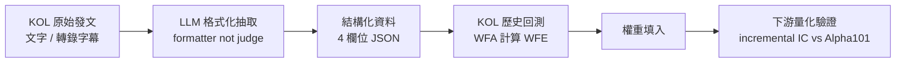

# 評審簡報大綱 v4 — 中文財經 KOL 觀點抽取與結構化建模

> **用途**:本文件為 Claude Design / 投影片生成工具的輸入素材
> **講者**:施博瀚(Stan Shih)／ 師大資工系
> **場合**:專題評審口頭報告(7 分鐘 + Q&A)
> **評分權重**:問題描述 20% / 方法與創新 60% / 實驗有效性 20%
> **語言**:繁體中文
> **版本**:v4(2026-04-24 修訂)
>
> **v4 主要變更(相對於 v3)**:
> 1. **標題改為「中文財經 KOL 觀點抽取與結構化建模」**,聚焦資料與方法論
> 2. **論述定位採「資訊擴散假說」(第二類機制)** — KOL 比散戶早解讀公開資訊,散戶慢半拍跟進產生時間差 edge
> 3. **範圍大幅收窄**:只保留(a) 觀點抽取 schema 與資料集、(b) 抽取方法與校準機制、(c) 下游量化驗證
> 4. **刪除 v3 內容**:載體分離因子、Bayesian 動態信任度、階層式分群、分歧度因子、時變相關結構
> 5. **LLM 角色降級**:LLM 只做「formatter」不做「judge」,評分不依賴 LLM 自評信心
> 6. **KOL 入池門檻改為 WFA / WFE** — out-of-sample 穩健性超過閾值才納入
> 7. **JSON schema 簡化為 4 欄位**:timestamp / id / direction / weight
> 8. **簡報結構改為 7 頁新骨架**:問題 → 缺口 → 方法 → 貢獻 → 驗證 → 進度風險 → 結論
> 9. **Contribution 由 5 個收斂為 3 個**:schema 設計、LLM-as-formatter 架構、WFA-based 驗證

---

## 〇、設計指引(給簡報生成工具)

- **頁數**:7 張投影片(含 Title),平均每頁 60 秒
- **風格**:學術簡報,深色背景,重點數字大字級突出
- **字級**:標題 ≥ 36pt,內文 ≥ 24pt
- **每頁限制**:最多 5 個 bullet
- **必備視覺**:第 3 頁方法流程圖、第 4 頁 contribution 對照、第 5 頁實驗設計
- **配色**:主色 #1E3A8A(深藍)、強調 #F59E0B(橘)、背景 #0F172A
- **避免**:所有 emoji

---

# 部分 A:投影片內容

---

## Slide 1:Title(融入問題,縮為第 0 頁)

**標題**:中文財經 KOL 觀點抽取與結構化建模

**副標**:Chinese Financial KOL Opinion Extraction and Structured Modeling for Downstream Quantitative Research

**講者資訊**:
- 施博瀚 / 師大資工系
- 指導教授:[填入]
- 2026 / [月份]

---

## Slide 1:問題(佔 20%)

**標題**:中文財經 KOL 的觀點,缺乏可量化的結構化資料

**核心問題**:
- 台灣股市散戶佔成交量約 50%,KOL 發文是影響散戶決策的重要來源
- KOL 相對散戶**更早解讀公開資訊**,散戶接收後慢半拍行動,存在**時間差 edge**
- 但 KOL 發文是**自由文本**,下游量化研究無法直接使用

**本專題要回答**:
> 如何把中文財經 KOL 的自由文本,轉為具**標準化 schema**、可**回測驗證**的結構化資料?

**為什麼這是個研究問題**:
- 不是爬蟲問題(爬蟲已可做)
- 不是情感分析問題(太粗)
- **是「欄位設計 × 抽取方法 × 下游驗證」的完整方法論問題**

---

## Slide 2:為何現有方法不夠(接續 20%)

**標題**:既有研究與工具的共同缺口

| 既有做法 | 缺口 |
|---|---|
| 通用情感分析(正/負/中性) | 欄位太粗,無法對應交易決策 |
| 財經新聞 NLP | 媒體是落後指標,不是 KOL 且風格不同 |
| 英文社群量化(Reddit/Twitter) | 中文財經缺少對等方法論與資料集 |
| banini-tracker(開源) | 單一 KOL、無 schema、無回測驗證 |
| LLM 直接當評分器 | 輸出不可回測、無法校準,且 confidence 不可靠 |

**缺的是什麼**:
1. **標準化 schema** — 能對應交易決策的最小欄位集
2. **穩定抽取方法** — LLM 輸出要可重現、可校準
3. **下游驗證** — 這套資料對量化因子是否真有 incremental 貢獻

**本研究要同時解決這三點**,而不是只做其中一塊。

---

## Slide 3:我的方法(60% — 主菜 1)

**標題**:三步驟 Pipeline — 抽取、校準、驗證

**整體流程**:



**核心 schema(4 欄位 JSON)**:

```json
{
  "timestamp": "2026-03-15T09:00:00+08:00",
  "id": "2330",
  "direction": 1,
  "weight": 0.65
}
```

| 欄位 | 意義 | 來源 |
|---|---|---|
| `timestamp` | KOL 發文時間 | 原始資料 |
| `id` | 標的代號 | LLM 抽取 + 實體消歧 |
| `direction` | 方向判斷(-1 空 / 0 觀望 / +1 多) | LLM 抽取 |
| `weight` | 此 KOL 的歷史 WFE | 離線回測計算 |

**三個關鍵設計決定**:

1. **LLM 只做 formatter**(不做 judge):
   - LLM 輸出方向(-1/0/+1),不輸出 confidence score
   - 避開 LLM 自評信心不可靠的問題
   - 評分外部化:交給 KOL 歷史表現決定權重

2. **權重 = KOL 歷史 WFE**(Walk-Forward Efficiency):
   - 對每位候選 KOL 跑 WFA 回測
   - 算出 out-of-sample 穩健性分數
   - 這個分數直接當權重
   - **高 WFE → 高權重;低 WFE → 低權重或剔除**

3. **資訊擴散假說(第二類機制)**:
   - 假設:KOL 不是內線,而是比散戶更早解讀公開資訊
   - 可驗證性:若假設成立,KOL direction 對「未來 T+N 日 報酬」應有顯著預測力
   - 不需量化情緒強度、不假設 KOL 有市場操縱力

---

## Slide 4:我的貢獻(60% — 主菜 2)

**標題**:三個 Personal Contribution

### Contribution 1:中文財經 KOL 觀點抽取 Schema + 自建標註資料集

- 定義最小充分的 4 欄位 schema(timestamp / id / direction / weight)
- 自建人工標註資料集(約 500 筆 KOL 貼文)
- **填補中文財經 KOL 結構化資料空白**

### Contribution 2:LLM-as-Formatter 混合架構

- LLM 只負責「文字 → 結構化欄位」的格式化工作
- **不讓 LLM 擔任最終評分者**(避開 confidence 不可靠問題)
- 評分透過 KOL 歷史實戰表現(WFA/WFE)外部化
- **少見的設計選擇**:在 LLM × 金融研究中,多數直接用 LLM 輸出 confidence;本研究選擇分離職責

### Contribution 3:WFA-based KOL 篩選與下游量化驗證

- 對候選 KOL 逐一跑 Walk-Forward Analysis
- 用 out-of-sample WFE 作為入池門檻
- 產出的結構化資料集進入下游量化驗證
- 量測 **incremental IC vs Alpha101**,驗證資料集對量化實際有用

**三者的關係**:
> Schema(C1)是**資料面**貢獻,LLM-as-Formatter(C2)是**方法面**貢獻,WFA 驗證(C3)是**實證面**貢獻。三者缺一即不構成完整方法論。

---

## Slide 5:實驗驗證方法(佔 20%)

**標題**:三層驗證

### 層 1:抽取品質驗證

- **資料**:500 筆人工標註 KOL 貼文
- **量測**:
  - 方向分類 F1(-1 / 0 / +1)
  - 標的消歧 accuracy(台積 ≡ 2330 ≡ TSMC)
  - 抽取一致性(多模型 cross-check 同意率)
- **預期**:F1 ≥ 0.75,消歧 accuracy ≥ 0.90,cross-check 同意率 ≥ 0.85

### 層 2:KOL 篩選(WFA/WFE)

- **程序**:
  1. 收集候選 KOL 歷史發文(18+ 個月)
  2. 對每位 KOL 跑 Walk-Forward Analysis(滾動訓練/測試切分)
  3. 計算每位 KOL 的 WFE(out-of-sample / in-sample 穩健比率)
  4. **WFE > 0.5 的 KOL 納入最終名單**
- **預期**:通過門檻的 KOL 數量 8–15 位

### 層 3:下游量化驗證

- **資料**:Phase 1 台積電單標的起步,Phase 2 擴至權值股前 5 檔
- **量測**:
  - 抽取後聚合因子的 IC
  - 對 Alpha101 的 **incremental IC**
  - **Baseline 目標**:incremental IC ≥ 0.03 / **Stretch**:≥ 0.05
  - Deflated Sharpe ≥ 0.8(扣除 multiple-testing bias)

**實驗分階段執行**:
- Phase 1:台積電單標的 PoC(月 4 完成)
- Phase 2:權值股前 5(月 6 完成)
- Phase 3:30 檔跨板塊(月 8 完成)

---

## Slide 6:目前進度 + 風險控制(接續 20%)

**標題**:已完成的基礎建設 + 主要風險與緩解

### 現有進度(已完成)

- ✓ Facebook / Threads 爬蟲管道
- ✓ YouTube / Podcast Whisper large-v3-turbo 轉錄
- ✓ LLM extract POC(Claude / GPT 雙模型)
- ✓ 台股 + 美股價格快取系統(point-in-time)
- ✓ vectorbt 回測框架

### 主要風險與緩解策略

| 風險 | 嚴重度 | 緩解策略 |
|---|---|---|
| **WFE 門檻導入 look-ahead bias** | 高 | 門檻訂在 train period 末端、嚴格時序切分、不以當下已知結果反推門檻 |
| **LLM 抽取不一致** | 中 | 雙模型 cross-check + 人工抽樣 10% 驗證 + 不一致樣本回人工 |
| **KOL 發文稀疏,樣本不足** | 中 | 設最低樣本數門檻(每 KOL ≥ 100 筆標的相關發文) |
| **抽取 schema 漏掉關鍵資訊** | 中 | 先跑 100 筆 pilot 人工標註,再 freeze schema |
| **incremental IC 不顯著** | 可接受 | Plan B — 交付 schema + dataset + 抽取 pipeline,下游驗證結果如實報告 |

### Plan B(退路)

若 Phase 3 incremental IC 不顯著:
- 仍交付完整 schema + 標註資料集(C1 貢獻保留)
- LLM-as-formatter 架構獨立可發表(C2 貢獻保留)
- WFA 驗證方法論獨立可發表(C3 貢獻保留)
- **三個 contribution 彼此獨立,不綁 incremental IC 成敗**

---

## Slide 7:結論

**標題**:交付物與學術定位

### 交付物

1. **資料**:中文財經 KOL 結構化資料集(約 500 筆人工標註 + 自動抽取擴充)
2. **方法**:LLM-as-Formatter 抽取 pipeline + WFA-based 篩選框架
3. **實證**:incremental IC 量測報告 + Phase 1/2/3 完整回測結果

### 學術定位

- **填補中文財經 KOL 結構化研究的方法論空白**
- **提出 LLM-as-Formatter(非 judge)的可驗證架構**,為 LLM × 金融研究提供可重現的範本
- 交付的資料集、schema、pipeline 皆可供後續研究延伸

### 後續可擴展方向

- 多 KOL 相關結構分析(v3 曾提,v4 留待下一階段)
- 時變動態權重(從靜態 WFE 升級為滾動 Bayesian 權重)
- 多載體整合(文字 + 影片 + 直播的時間尺度錯位建模)

**結語**:
> 「本專題目標明確:為中文財經 KOL 打造從抽取到驗證的完整方法論。**不追求單一賣點,而是讓 schema、抽取架構、驗證方法三者成為獨立可用的研究成果**,即使下游 incremental IC 不顯著,前兩項仍具獨立學術貢獻。」

---

# 部分 B:講者腳本(嚴格 7 分鐘 = 420 秒)

| 時間 | 投影片 | 講稿 |
|---|---|---|
| **0:00–0:30** | Title | 「各位老師好,我是師大資工系的施博瀚。今天報告的專題是『中文財經 KOL 觀點抽取與結構化建模』——目標是把網紅的自由文本,做成可回測、可重現的結構化資料。」 |
| **0:30–1:30** | Slide 1 問題 | 「台灣股市散戶佔成交量約一半,KOL 對散戶決策影響很大。KOL 比散戶更早解讀公開資訊,散戶慢半拍跟進,中間存在時間差的 edge。但 KOL 發文是自由文本,下游量化無法直接用。所以核心問題是:**如何把中文財經 KOL 的自由文本,轉為標準化、可回測的結構化資料**。這不是爬蟲問題、不是情感分析問題,而是欄位設計 × 抽取方法 × 下游驗證的完整方法論問題。」 |
| **1:30–2:30** | Slide 2 缺口 | 「既有做法各有缺口。通用情感分析太粗;財經新聞 NLP 是媒體落後指標;英文社群量化研究不適用中文市場;banini-tracker 只追一人沒有 schema 沒有回測;直接用 LLM 評分無法重現無法校準。缺的是**標準化 schema、穩定抽取方法、下游驗證**這三件事同時解決的方法論。」 |
| **2:30–4:00** | Slide 3 方法 | 「方法分三步驟。**抽取**:LLM 只做 formatter,輸入自由文本輸出 4 欄位 JSON — 時間戳、標的 id、方向(-1/0/+1)、權重。注意 LLM 不做評分、不輸出 confidence。**校準**:對每個候選 KOL 跑 WFA(Walk-Forward Analysis),算出 out-of-sample 的 WFE 分數,這個分數當 JSON 的 weight 欄位。**驗證**:用這份結構化資料建因子,量測對 Alpha101 的 incremental IC。**定位上採資訊擴散假說**——KOL 比散戶早解讀公開資訊,我們交易的是這個時間差,不假設 KOL 有內線、不假設 KOL 操縱情緒。」 |
| **4:00–5:30** | Slide 4 貢獻 | 「三個 contribution。**第一,資料面**:定義 4 欄位 schema 並自建 500 筆人工標註資料集,填補中文財經 KOL 結構化資料空白。**第二,方法面**:LLM-as-Formatter 混合架構,讓 LLM 只做格式化、評分交給歷史表現,避開 LLM confidence 不可靠問題;這在 LLM × 金融文獻中較少見。**第三,實證面**:WFA-based KOL 篩選 + 下游 incremental IC 驗證,完整走完抽取到量化落地的鏈路。三個 contribution 彼此獨立,即使下游 IC 不顯著,前兩個仍獨立可發表。」 |
| **5:30–6:20** | Slide 5 驗證 | 「實驗三層。層 1 測抽取品質,方向分類 F1 ≥ 0.75、消歧 accuracy ≥ 0.90。層 2 測 KOL 篩選,用 WFE > 0.5 當門檻,預期通過 8 到 15 位。層 3 測下游價值,incremental IC baseline 目標 0.03、stretch 0.05。實驗分三 Phase:先台積電單標的、再權值股前 5、最後跨板塊 30 檔。」 |
| **6:20–6:50** | Slide 6 進度風險 | 「爬蟲、Whisper、LLM extract、回測框架都已實作完成。主要風險是 WFE 門檻可能導入 look-ahead,用嚴格時序切分緩解;LLM 抽取不一致用雙模型 cross-check;最終若 IC 不顯著,schema 與資料集與抽取架構三者仍獨立可交付。」 |
| **6:50–7:00** | Slide 7 結論 | 「本專題目標是做完整方法論,不追求單一賣點,而是讓三個 contribution 獨立可用。謝謝老師。」 |

---

# 部分 C:視覺素材建議

## C.1 Title / Slide 1 問題
- 核心數字「**50%**」字級 96pt 橘色,「散戶佔台股成交量」
- 副圖:KOL 發文 → 時間差 → 散戶行動 → 價格反應 的示意

## C.2 Slide 3 方法
- Mermaid 流程圖直接 render
- 4 欄位 JSON 用 code block 大字級呈現
- 「LLM-as-Formatter」用 NEW 標籤

## C.3 Slide 4 貢獻
- 3 列卡片(資料 / 方法 / 實證)並排
- 每張卡片寫清楚「交付物」與「為什麼獨立可用」

## C.4 Slide 5 實驗
- 三層驗證縱向排列
- Phase 1/2/3 用時間軸示意(台積 → 5 檔 → 30 檔)

---

# 部分 D:Q&A 防禦準備

## Q1:「為什麼採資訊擴散假說(第二類)而不是其他機制?」
**答**:KOL 有內線但願意公開(第一類)邏輯矛盾,有內線就不會免費公開;散戶推動價格(第三類)與末期倒貨(第四類)需要 KOL 對市場有顯著影響力,個別 KOL 做不到。唯一合理可驗證的是第二類——KOL 比散戶早解讀公開資訊,散戶慢半拍跟進產生時間差。這個假說最容易被實證檢驗:如果成立,KOL direction 對 T+N 日報酬應有顯著預測力;如果不成立,我們會如實報告。

## Q2:「LLM 抽取不準怎辦?那你整個資料集都是錯的。」
**答**:三層緩解。第一,LLM 只做格式化不做評分,犯錯範圍有限。第二,雙模型 cross-check,不一致樣本回人工。第三,10% 抽樣人工驗證,若一致率 < 0.85 就 freeze schema 重來。更關鍵的是:LLM 抽取錯誤會在 WFA 層被懲罰——某 KOL 的抽取訊號若系統性錯誤,他的 WFE 會低,權重會低,最終下游 IC 會反映這點。系統有自我淨化機制。

## Q3:「WFE 篩選 KOL 會不會就是倖存者偏差?」
**答**:是學術上最容易被攻擊的點,我用三個設計緩解。第一,WFA 本身就是 out-of-sample 驗證,不是 in-sample 挑人。第二,門檻是先驗定義(WFE > 0.5),不根據最終 IC 反推調整。第三,時序嚴格切分,WFE 計算只使用訓練期末端之前的資料。這不是「挑歷史贏家」,而是「根據歷史 out-of-sample 穩健性設池」——量化工業界的標準做法。

## Q4:「為什麼不用 fine-tune 傳統 NLP 而要 LLM?」
**答**:傳統 NLP 需要數萬筆中文財經標註資料,現成資料集幾乎沒有。LLM zero/few-shot 已能達到可用品質。成本用混合策略:粗篩用 Haiku,細粒度抽取才用 Sonnet,實測單篇 < $0.001。且 LLM 的優勢在於 schema 演化 —— 未來若擴充欄位(例如加入時間框、信心),LLM 架構可快速迭代,傳統 NLP 每次都要重 fine-tune。

## Q5:「7 分鐘的範圍你真的做得完嗎?」
**答**:已有實作基礎(爬蟲、Whisper、LLM extract、回測框架都跑通)。**v4 相較早期版本大幅收窄範圍**,只做抽取 + 校準 + 驗證,不做多載體融合、不做 Bayesian、不做分群。三個 contribution 彼此獨立可交付,就算 Phase 3 做不完,Phase 1 + Phase 2 的結果仍構成完整專題。

## Q6:「和 banini-tracker 差別?」
**答**:五個本質差異:(1) 多 KOL 跨平台 vs 單一 KOL;(2) 標準化 schema vs 無 schema;(3) LLM-as-Formatter 架構 vs 純通知系統;(4) WFA-based KOL 篩選 vs 主觀追蹤;(5) 下游量化驗證 vs 無回測。簡言之,banini-tracker 是個人工具,本研究是可交付給後續研究延伸的**方法論 + 資料集 + 驗證框架**。

---

# 部分 E:技術參考

## E.1 關鍵文獻
- Bollen, J. et al. (2011). "Twitter mood predicts the stock market." Journal of Computational Science.
- Niculescu-Mizil, A. & Caruana, R. (2005). "Predicting Good Probabilities With Supervised Learning." ICML.
- Bailey, D. H. & Lopez de Prado, M. (2014). "The Deflated Sharpe Ratio." Journal of Portfolio Management.
- Kakushadze, Z. (2016). "101 Formulaic Alphas." Wilmott.
- Lopez de Prado, M. (2018). "Advances in Financial Machine Learning." Wiley.(WFA 方法論)
- Pardo, R. (2008). "The Evaluation and Optimization of Trading Strategies." Wiley.(WFE 原始定義)

## E.2 技術棧

| 元件 | 選型 | 理由 |
|---|---|---|
| 爬蟲 | Apify + 自寫 fallback | 反爬機制日益嚴,需多源 |
| 語音轉錄 | Whisper large-v3-turbo | 中文表現 SOTA |
| LLM | Claude Sonnet + Haiku 混合 | formatter 用 Haiku、難 case 用 Sonnet |
| 資料庫 | SQLite + Parquet | 輕量 + point-in-time 嚴格 |
| 回測 | vectorbt + 自寫 WFA 框架 | 向量化 + 客製 walk-forward |
| 標註工具 | Label Studio | 人工 10% 抽樣驗證 |

---

# 部分 F:給簡報生成工具的使用說明

請依照以下順序生成 7 張投影片:

1. **直接使用「部分 A」每個 Slide 段落作為對應投影片內容**
2. **「部分 B」講者腳本** 塞到每張投影片的 speaker notes
3. **「部分 C」視覺建議** 用來決定 layout 與圖表
4. **「部分 D」Q&A** 附在最後一張之後當備用 slides(不算在 7 張內)
5. **「部分 E」技術參考** 作為 appendix slides

**重要約束**:
- 嚴禁加任何投影片以外的內容
- 嚴禁修改或創新內容,完全照本文件做
- 如有疑慮先停下來問,不要自行發揮

---

**END OF DOCUMENT (v4)**
