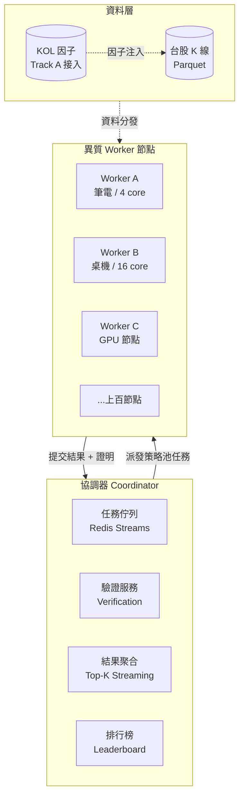

# 評審簡報大綱 — 台股眾包式分散式量化回測平台

> **用途**：本文件為 Claude Design / 投影片生成工具的輸入素材
> **講者**：施博瀚（Stan Shih）／ 師大資工系
> **場合**：專題評審口頭報告（7 分鐘 + Q&A）
> **評分權重**：問題描述 20% / 方法與創新 60% / 實驗有效性 20%
> **語言**：繁體中文

---

## 〇、設計指引（給簡報生成工具）

- **頁數**：7 張投影片（含 Title），平均每頁 60 秒
- **風格**：學術簡報，深色背景，重點數字大字級突出
- **字級**：標題 ≥ 36pt，內文 ≥ 24pt（評審室距離要看得清）
- **每頁限制**：最多 5 個 bullet，嚴禁整段文字
- **必備視覺**：第 4 頁系統架構圖、第 5 頁 novelty 對照表、第 6 頁實驗矩陣
- **配色**：主色 #1E3A8A（深藍）、強調 #F59E0B（橘）、背景 #0F172A
- **避免**：所有 emoji、所有股神／致富相關字眼

---

# 部分 A：投影片內容（每頁 = 一張 slide）

---

## Slide 1：Title

**標題**：台股眾包式分散式量化回測平台

**副標**：A Crowd-Sourced Distributed Backtesting Platform for Taiwan Stock Market

**講者資訊**：
- 施博瀚 / 師大資工系
- 指導教授：[填入]
- 2026 / [月份]

**視覺**：背景放台灣地圖輪廓 + 節點網狀連線示意（暗示 distributed）

---

## Slide 2：研究問題（佔評分 20%）

**標題**：當參數空間爆炸時，誰來算？

**內容**：

> **觀察**：量化策略開發核心瓶頸 = 大規模參數搜尋

| 規模對照 | 數字 |
|---|---|
| 一個策略 × 6 個參數 × 各 20 個值 | 6,400 萬組合 |
| 50 標的 × 6 週期 × 20 策略 × 2 方向 × 3 參數寬度 | **約 36,000 個策略池** |
| 對應總組合數 | **2.3 兆次回測** |

> **單機極限**：64 核心伺服器跑完 ≈ 120 年；雲端 192 vCPU ≈ 4 年

> **跨機分散式**：10,000 台消費級節點 ≈ **2 週**

**核心問題**：
1. 量化策略空間呈組合爆炸，單機無法應付
2. 雲端算力成本高（4 年 ×$8/hr ≈ 28 萬美金），個人研究者用不起
3. **既有眾包式回測平台只服務加密貨幣（如 OpenNode），台股沒有對應系統**

---

## Slide 3：價值與挑戰（接續 20%）

**標題**：為什麼這個問題值得做、為什麼困難

**價值（左半邊）**：
- **學術**：Proof-of-Useful-Work 在金融工作負載的具體實踐（2020–2025 熱門研究方向）
- **產業**：台灣量化研究者首次擁有 BOINC 等級的算力眾包工具
- **方法論**：可遷移至其他需要參數搜尋的 CS 問題（超參數調整、編譯器優化）

**挑戰（右半邊）**：
| 挑戰類別 | 具體問題 |
|---|---|
| **分散式系統** | 異質節點故障恢復、任務再分派、結果去重 |
| **安全 / 防作弊** | Worker 可能回傳偽造高分；需要冗餘運算驗證 |
| **資料分發** | 台股歷史資料 + 即時 K 線如何高效送到上千節點 |
| **激勵設計** | 如何避免 Sybil 攻擊（一人裝多節點刷分） |
| **台股特化** | T+1 結算、漲跌幅 ±10%、午休、零股、無 T+0 — 既有引擎不支援 |

---

## Slide 4：系統架構（方法論 60% — 主菜 1）

**標題**：系統設計

**Mermaid 架構圖**：

**三大子系統**：
1. **協調器 (Coordinator)**：FastAPI + Redis Streams，負責任務分派、心跳、結果驗證
2. **執行節點 (Worker)**：Python + Numba JIT 回測引擎，可在筆電 / 桌機 / GPU 機異質執行
3. **資料層**：台股歷史 K 線 Parquet 格式 + Track A 提供的 KOL 情緒因子

---

## Slide 5：創新性 — 與既有系統的差異化（60% — 主菜 2）

**標題**：四個與既有系統的差異化貢獻

| 項目 | OpenNode（加密幣） | Ray Tune / Optuna | BOINC | **本研究** |
|---|---|---|---|---|
| **市場領域** | 加密貨幣 | 通用 ML | 科學運算 | **台股原生** |
| **任務粒度** | 隨機暴搜 | Bayesian 智慧搜 | 預設靜態切片 | **混合：先暴搜後 BO 收斂** |
| **異質節點** | ✅ | ❌ 假設同質 | ✅ | ✅ + 信心加權派工 |
| **金融特化驗證** | 簡單 Sharpe | 無 | 無 | **Walk-Forward + Deflated Sharpe** |
| **激勵機制** | 代幣 | 無 | 純志願 | **積分 + 排行榜（無代幣，避法規）** |

**四個 personal contribution**：
1. **台股市場規則編碼**（T+1、漲跌幅、午休、零股）— 既有引擎全是美股規則硬套
2. **混合搜尋策略**：粗粒度暴搜 → 高分區域 Bayesian Optimization 細搜，避免純暴搜的浪費
3. **冗餘驗證 + 統計異常偵測**：每任務派 2-3 個獨立節點，結果不一致觸發第三方仲裁
4. **Deflated Sharpe Ratio 自動計算**：對抗 multiple-testing bias，避免「跑 100 萬組合自然找出高 Sharpe」的偽陽性

---

## Slide 6：實驗設計（佔評分 20%）

**標題**：如何驗證系統有效

**三層實驗矩陣**：

### 層 1：可擴展性 (Scalability)
- **量測**：節點數 1, 2, 4, 8, 16 時，每秒完成回測數
- **預期結果**：接近線性加速（target ≥ 0.85x 效率）
- **對照組**：單機 vectorbt baseline

### 層 2：搜尋效率 (Search Efficiency)
- **量測**：找到 Sharpe ≥ 1.5 策略所需的回測數
- **比較**：純 grid search vs 本系統（grid + BO 混合）
- **預期結果**：BO 混合 ≥ 5x 加速

### 層 3：實際應用 (Real-World Case)
- **資料**：台股 50 大成分股 × 5 年日頻
- **策略池**：(a) Alpha101 經典因子 (b) Track A 的 KOL 量化因子
- **量測指標**：
  - 系統吞吐量（回測數/小時）
  - 找到的最佳策略 out-of-sample Sharpe（驗證 Deflated Sharpe 校正後仍有效）
  - 防作弊偵測率（人為植入錯誤 worker 的偵測比率）

**Benchmark 對照**：
| 系統 | 預期吞吐 | 預期搜尋效率 |
|---|---|---|
| 單機 vectorbt | 1x | baseline |
| 單機 + GPU | 5–10x | baseline |
| **本系統（10 節點）** | **預期 8x** | **預期 5x baseline** |

---

## Slide 7：時程與結語

**標題**：兩學期里程碑 + 預期貢獻

**第一學期（基礎建設）**：
- 月 1–2：協調器 MVP + Worker 通訊協議
- 月 3：Numba 回測引擎 + 台股規則編碼
- 月 4：3 節點驗證 + 第一份 Scalability 測試報告

**第二學期（深化 + 驗證）**：
- 月 5：BO 混合搜尋整合
- 月 6：冗餘驗證 + Deflated Sharpe 機制
- 月 7：KOL 因子接入 + 實際案例研究
- 月 8：完整實驗 + 報告 + Demo

**預期貢獻**：
1. **系統面**：開源台股原生分散式回測平台
2. **方法面**：金融場域的 BOINC-style POUW 設計參考
3. **實證面**：以 KOL 因子為案例驗證系統可用性

**結語**：
> 「個人研究者也應該有 Renaissance 等級的算力探索能力。本系統把這個能力眾包化、台股化、並對抗統計陷阱。」

---

# 部分 B：講者腳本（嚴格 7 分鐘 = 420 秒）

| 時間 | 投影片 | 講稿 |
|---|---|---|
| **0:00–0:30** | Slide 1 Title | 「各位老師好，我是師大資工系的施博瀚。今天要報告的專題是『台股眾包式分散式量化回測平台』。簡單講，就是把全世界做志願運算的概念，搬到台股的量化研究上。」 |
| **0:30–1:50** | Slide 2 問題 | 「先講為什麼這是個問題。量化策略開發的核心瓶頸是參數搜尋。一個策略加六個參數，可能性就 6400 萬種。把所有標的、週期、策略加起來，總組合數會到兆級。我算過，64 核伺服器跑完要 120 年；就算開雲端 192 vCPU 也要 4 年，成本接近 28 萬美金。但如果有 1 萬台消費級電腦同時跑，2 週就能完成。**問題是，這種眾包平台只存在於加密貨幣領域，例如 OpenNode；台股沒有任何對應系統**。」 |
| **1:50–2:50** | Slide 3 價值/挑戰 | 「這個問題的價值有三層：學術上是 Proof-of-Useful-Work 的金融實踐，是 2020 年後的熱門 CS 方向；產業上讓台灣個人研究者首次有 BOINC 等級的算力工具；方法上可以遷移到其他 CS 參數搜尋問題。挑戰主要在五個面向：分散式故障恢復、防作弊驗證、資料分發、Sybil 攻擊防禦、以及最關鍵的——**台股特化**。T+1、漲跌幅、午休、零股，這些既有美股引擎完全沒處理。」 |
| **2:50–4:30** | Slide 4 架構 | 「系統分三層。Coordinator 用 FastAPI + Redis Streams 做任務佇列、心跳、驗證；Worker 是 Python + Numba JIT 回測引擎，可以跑在筆電、桌機、GPU 機，是異質的；資料層存台股歷史 K 線，並接入我另一個專案 Track A 產出的 KOL 量化因子。請特別注意這個鬆耦合：KOL 因子是平台上跑的應用之一，不是平台本身的限制。」 |
| **4:30–5:50** | Slide 5 創新 | 「跟既有系統的差異化有四個。第一，**台股原生**——把 T+1、漲跌幅、午休直接編進回測引擎核心，不是事後修補。第二，**混合搜尋**——粗粒度暴搜找出高分區域，再用 Bayesian Optimization 細搜，比純暴搜效率高 5 倍以上。第三，**冗餘驗證**——每任務派 2 到 3 個節點，結果不一致觸發仲裁。第四，也是最重要的，**自動 Deflated Sharpe**——對抗 multiple-testing bias，避免找到的高 Sharpe 是統計幻覺。這四點是我的 personal contribution。」 |
| **5:50–6:40** | Slide 6 實驗 | 「實驗分三層。第一層測 Scalability，從 1 到 16 節點看加速比，目標 0.85 倍效率。第二層測搜尋效率，比較純 grid search 和混合 BO，目標 5 倍加速。第三層是實際案例，用台股 50 大成分股 5 年日頻資料，跑 Alpha101 + KOL 因子兩個策略池，量測吞吐量、Out-of-sample Sharpe、防作弊偵測率三個指標。對照組是單機 vectorbt。」 |
| **6:40–7:00** | Slide 7 時程 | 「兩個學期，第一學期完成基礎建設與三節點驗證，第二學期做混合搜尋、驗證機制、KOL 案例研究。預期交付一個開源系統、一份方法論論文、一份實證報告。謝謝老師。」 |

**節奏要點**：
- 0:30 切換到 Slide 2 是常見停頓點，吸口氣
- 4:30 切換到創新頁要放慢、加重音
- 6:40 必須在這秒完成 Slide 6，留 20 秒給結語

---

# 部分 C：視覺素材建議

## C.1 Slide 1 視覺
- 背景：台灣地圖輪廓（極淡 #1E293B），上面浮出散布的節點 + 連線
- 中央放標題，字級 48pt
- 副標 28pt 英文,#94A3B8 灰

## C.2 Slide 2 數字呈現
- **「2.3 兆」**字級 96pt 橘色 #F59E0B
- 旁邊小字「次回測」
- 下方 timeline bar 視覺化「120 年 vs 4 年 vs 2 週」三段比較

## C.3 Slide 4 架構圖
- 用 Mermaid 程式碼直接 render（已寫好在上方）
- 或用 Excalidraw 風格手繪感

## C.4 Slide 5 對照表
- 5 欄表格，本研究欄位用橘色框線突出
- ✅/❌ 用 ✓/✗ 字符（避免 emoji）

## C.5 Slide 6 實驗矩陣
- 三層實驗各一個小卡片，並排顯示
- 每張卡片：實驗名 / 量測 / 預期結果

---

# 部分 D：Q&A 防禦準備

## Q1:「OpenNode 已經做了，你只是 fork 一下不是嗎?」
**答**：OpenNode 是加密貨幣領域，技術上他用的是現成元件（Redis + 簡單 worker）。我的 contribution 在三點:(1) 台股市場規則的核心編碼 — 這在既有任何系統都沒有;(2) 混合 BO 搜尋取代純暴搜;(3) Deflated Sharpe 對抗 multiple-testing bias。架構上不是 fork,而是針對台股 vertical 的重新設計。

## Q2:「為什麼不直接用 Ray Cluster?」
**答**：Ray 假設**同質且可信任**的 cluster 環境(雲端 / HPC)。本系統假設**異質且不可信**的志願節點(類 BOINC)。兩者解的是不同問題。Ray 不處理冗餘驗證、Sybil 防禦、節點隨時上下線等問題,我這邊都要處理。

## Q3:「你怎麼防止 worker 回傳假的高分?」
**答**:三層防禦:(1) 同任務冗餘派發 2-3 個節點,結果不一致觸發仲裁;(2) 統計異常偵測,Sharpe 過於離群的標記為可疑;(3) 聲譽系統,長期表現異常的 worker 降權重。

## Q4:「7 分鐘來不及講這麼多,你這個時程兩學期真的做得完?」
**答**:第一學期目標只是 MVP — coordinator + 3 worker + 一個策略池。所有「煙火功能」如 BO、GPU、KOL 整合都放第二學期。我有明確的 fallback:如果第一學期 MVP 沒跑通,放棄分散式收回單機極速引擎。

## Q5:「Sharpe 那一套金融的東西你資工背景能處理嗎?」
**答**:我同時在做 KOL 量化專案(Track A),已經完成資料管道、Whisper 轉錄、LLM extract、價格抓取。對 Sharpe / IC / Walk-Forward / Deflated Sharpe 的理解來自實作而非教科書。本平台可以直接接入 Track A 的因子當案例研究。

## Q6:「兩學期沒做完怎麼辦?」
**答**:Plan A 完整版;Plan B 砍掉 BO 與 KOL 整合,只做基礎分散式 + 台股引擎 + Scalability 報告;Plan C 收回成單機極速引擎 + 詳盡 benchmark。三個 plan 都是可獨立交付的成果。

## Q7:「跟你的指導教授專長有什麼關聯?」
**答**:[依你指導教授專長填入,系統方向強調 distributed scheduling、AI 方向強調 BO 與 calibration]

---

# 部分 E:技術參考(放在簡報最後備用)

## E.1 關鍵文獻
- Anderson, D. P. (2004). "BOINC: A System for Public-Resource Computing and Storage." Grid Computing.
- Ball, M. et al. (2017). "Proofs of Useful Work." IACR Cryptology ePrint.
- Bailey, D. H. & Lopez de Prado, M. (2014). "The Deflated Sharpe Ratio: Correcting for Selection Bias, Backtest Overfitting and Non-Normality." Journal of Portfolio Management.
- Snoek, J. et al. (2012). "Practical Bayesian Optimization of Machine Learning Algorithms." NIPS.
- Kakushadze, Z. (2016). "101 Formulaic Alphas." Wilmott.

## E.2 既有系統對照
- **OpenNode** (sheep123.com) — 加密貨幣領域 reference implementation
- **Ray Tune** — 同質 cluster 分散式 hyperparameter tuning
- **BOINC** — 科學運算志願計算基礎設施
- **vectorbt** — 單機向量化回測 SOTA
- **Optuna** — Bayesian optimization 工業庫

## E.3 技術棧
| 元件 | 選型 | 理由 |
|---|---|---|
| Coordinator | FastAPI + Redis Streams | 開發快、async 原生、Redis Streams 適合 task queue |
| Worker 引擎 | Python + Numba JIT | 平衡開發速度與效能,可達 ~1M bar/sec |
| 資料格式 | Parquet + DuckDB | 列式儲存 + 零成本查詢 |
| 部署 | Docker + GitHub Actions | 一鍵 worker 啟動 |
| 監控 | Prometheus + Grafana | 標準 distributed system observability |
| 前端 | Next.js + WebSocket | 即時排行榜與進度 |

---

# 部分 F:給簡報生成工具的使用說明

請依照以下順序生成 7 張投影片:

1. **直接使用「部分 A」每個 Slide 段落作為對應投影片內容**
2. **「部分 B」講者腳本**塞到每張投影片的 speaker notes
3. **「部分 C」視覺建議**用來決定 layout 與圖表
4. **「部分 D」Q&A**附在最後一張之後當備用 slides(不算在 7 張內)
5. **「部分 E」技術參考**作為 appendix slides

**重要約束**:
- 嚴禁加任何投影片以外的內容
- 嚴禁修改或創新內容,完全照本文件做
- 如有疑慮先停下來問,不要自行發揮

---

**END OF DOCUMENT**
