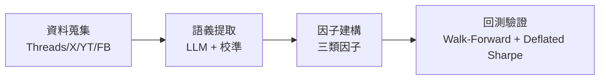
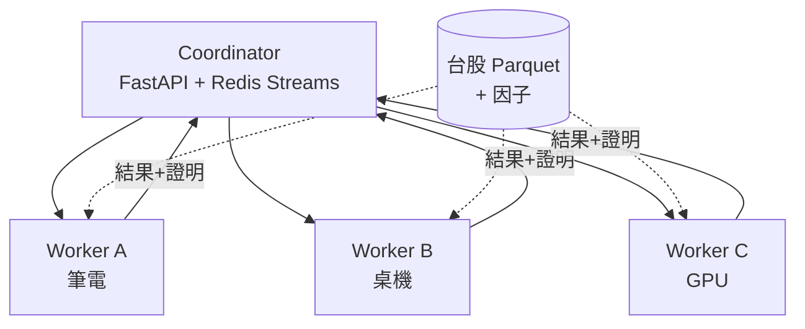

# 評審簡報大綱 — 雙題目探索階段報告

> **用途**:本文件為 Claude Design / 投影片生成工具的輸入素材
> **講者**:施博瀚(Stan Shih)/ 師大資工系
> **場合**:專題評審口頭報告(7 分鐘 + Q&A)
> **評分權重**:問題描述 20% / 方法與創新 60% / 實驗有效性 20%
> **語言**:繁體中文
> **核心 framing**:**目前處於題目探索階段,正在兩個候選題目間評估,今天兩題都完整報告**
> **參考**:本檔案是兩份詳細版的 7 分鐘合併版
>   - `docs/評審簡報_KOL量化平台.md`
>   - `docs/評審簡報_分散式回測平台.md`

---

## 〇、設計指引(給簡報生成工具)

- **頁數**:7 張投影片(含 Title)
- **配色**:主色 #1E3A8A(深藍)、強調 #F59E0B(橘)、背景 #0F172A
- **字級**:標題 ≥ 36pt,內文 ≥ 24pt
- **每頁限制**:最多 5 個 bullet
- **特殊設計**:題目 A 與題目 B 用不同 accent 色區分(A 用青 #06B6D4,B 用橘 #F59E0B),投影片標題加色帶,評審視覺上一眼分辨
- **必備視覺**:Slide 4 KOL 架構圖、Slide 5 分散式架構圖、Slide 7 對照表
- **避免**:所有 emoji

---

# 部分 A:投影片內容

---

## Slide 1:Title

**標題**:量化研究專題 — 雙題目探索階段報告

**副標**:Two Candidate Topics in Quantitative Research

**講者資訊**:
- 施博瀚 / 師大資工系
- 指導教授:[填入]
- 2026 / [月份]

**頁面下方標註**(關鍵 framing):
> 本次報告呈現兩個候選題目,目前處於評估與抉擇階段,期待評審意見。

**視覺**:左右並排兩個 icon — 左邊 KOL 頭像剪影(青色),右邊節點網狀(橘色),中央問號或天秤,呼應「抉擇中」

---

## Slide 2:研究脈絡 — 為什麼有兩個候選(佔 20%)

**標題**:量化研究的兩個 CS 切入點

**內容**:
> 在量化研究領域中,作為資工背景的研究者,我看到兩個有意義的 CS 切入點:

| 切入點 | 對應題目 | 主要 CS 領域 |
|---|---|---|
| **「訊號從哪來」**:把雜訊資料變成可交易因子 | 題目 A:KOL 量化 | NLP / ML / Stat |
| **「算力如何眾包」**:大規模參數搜尋 | 題目 B:分散式平台 | Distributed Systems |

**共同背景**:
- 量化基金正積極追求**另類數據**(KOL、衛星、信用卡)與**算力規模**(雲端、HPC)
- 兩者皆有**台灣本地空白**:中文財經 KOL 無系統化研究、台股無分散式回測平台
- 兩題都符合資工專題對 personal contribution 的要求

**目前狀態**:
- 題目 A 已有實作基礎(Whisper 轉錄、LLM extract、價格快取已跑通)
- 題目 B 在規劃階段,參考 OpenNode(加密貨幣)為 reference

---

## Slide 3:題目 A — KOL 量化(問題 + 創新)

**標題**:題目 A:多 KOL 跨平台量化情緒因子系統

**色帶**:青色(#06B6D4)

**問題**:
- 台灣財經 KOL 在 Threads / X / YouTube 影響數十萬散戶
- 散戶行為早於市場定價,存在短暫可交易視窗
- **無任何系統**將此影響力量化(banini-tracker 只追單人,無因子化)

**核心命題**:
> KOL 預測品質本身是可量化的 latent variable;rolling 追蹤 → 量化因子

**四個 Personal Contribution**(對應 60% 創新):
1. **動態 Bayesian 信任度** — Beta-Binomial 共軛先驗追蹤條件勝率
2. **LLM 信心校準** — Isotonic Regression 把 LLM 自評信心校到實際勝率
3. **Point-in-Time Bitemporal Schema** — 嚴格無 look-ahead bias
4. **多模態融合** — 文字 + Whisper 語音 prosody

---

## Slide 4:題目 A — 系統架構與實驗(60% + 20%)

**標題**:題目 A:四層 Pipeline + 三層實驗

**色帶**:青色(#06B6D4)

**Mermaid 架構圖**(精簡版):

**三層實驗**:
| 層級 | 量測 | 預期目標 |
|---|---|---|
| NLP 品質 | F1 / Calibration ECE | F1 ≥ 0.75, ECE ≤ 0.05 |
| 因子有效性 | Rolling IC / IC 衰減 | 聚合 IC ≥ 0.05 |
| 策略有效性 | OOS Sharpe / Deflated Sharpe | 1.5 / 1.0 |

**已完成的可行性證據**(降低評審風險疑慮):
- Facebook / Podcast 資料管道 ✓
- Whisper large-v3-turbo 中文轉錄 ✓
- LLM extract POC ✓
- 台股價格快取 ✓

---

## Slide 5:題目 B — 分散式平台(問題 + 創新)

**標題**:題目 B:台股眾包式分散式回測平台

**色帶**:橘色(#F59E0B)

**問題**:
- 量化策略開發核心瓶頸 = 大規模參數搜尋
- 一個策略池 6,400 萬組合 × 36,000 池 = **2.3 兆次回測**
- 單機 4 年起跳;眾包 10,000 節點 = 2 週
- **既有眾包回測平台只服務加密貨幣(OpenNode),台股零對應**

**參考案例**:
- OpenNode (sheep123.com):總策略池參數 48 億,已完成 9000 萬,過審 11,618 個策略
- 證明商業模式 + 技術架構可行,但無台股版本

**四個 Personal Contribution**(對應 60% 創新):
1. **台股市場規則編碼** — T+1、漲跌幅 ±10%、午休、零股(美股引擎全沒做)
2. **混合搜尋策略** — 粗粒度 grid + 高分區 Bayesian Optimization
3. **冗餘驗證 + 異常偵測** — 對抗 worker 偽造高分
4. **Deflated Sharpe 自動校正** — 對抗 multiple-testing bias 的偽陽性

---

## Slide 6:題目 B — 系統架構與實驗(60% + 20%)

**標題**:題目 B:三層架構 + 三層實驗

**色帶**:橘色(#F59E0B)

**Mermaid 架構圖**(精簡版):

**三層實驗**:
| 層級 | 量測 | 預期目標 |
|---|---|---|
| Scalability | 1→16 節點加速比 | 0.85x 線性效率 |
| 搜尋效率 | 找到 Sharpe ≥ 1.5 所需回測數 | BO 混合 ≥ 5x baseline |
| 實際應用 | 台股 50 大 × 5 年 + Alpha101 | 系統完整 demo |

**對照組**:單機 vectorbt / 單機 + GPU / 本系統(10 節點)

---

## Slide 7:對照、評估、時程(結語)

**標題**:兩題目對照與我目前的評估

**對照表**:

| 維度 | 題目 A:KOL 量化 | 題目 B:分散式平台 |
|---|---|---|
| **CS 風味** | NLP / ML / Stat | Distributed Systems / Security |
| **可行性證據** | 已有實作基礎 | OpenNode 商業驗證 |
| **創新關鍵點** | LLM Calibration + Bayesian 信任度 | 台股原生 + 混合 BO 搜尋 |
| **量測指標** | IC / Sharpe / Calibration ECE | Throughput / Scaling 效率 |
| **失敗風險** | KOL 因子可能無顯著 IC | 異質節點工程複雜度 |
| **可獨立交付** | ✓ | ✓ |

**目前的傾向與不確定性**:
- 兩題各自都符合資工專題標準
- 兩題有自然鬆耦合(KOL 因子可作為分散式平台上的策略池之一)
- **正在評估:哪個更貼近指導教授的研究方向、哪個 personal contribution 更鮮明**
- **期待評審指引**:在這兩個方向上,您認為哪個更有研究價值?

**兩學期共同時程框架**:
- 第一學期:深化選定題目的 MVP + 第一份實驗報告
- 第二學期:進階 contribution + 完整實驗 + 報告

**結語**:
> 「兩個題目都是把資工專長帶進量化研究領域的嘗試,
>  也都符合『個人有意義 contribution』的標準。
>  今天的目標是讓老師看到我評估的完整性,並期待您的方向建議。」

---

# 部分 B:講者腳本(嚴格 7 分鐘 = 420 秒)

| 時間 | 投影片 | 講稿 |
|---|---|---|
| **0:00–0:45** | Slide 1 Title | 「各位老師好,我是師大資工系的施博瀚。今天的報告比較特別 — 我目前在兩個量化研究題目之間評估,還沒有最終決定要做哪一個,所以今天會把**兩題都完整報告**,期待老師給我方向建議。」 |
| **0:45–1:30** | Slide 2 脈絡 | 「先講我為什麼會選這兩題。從資工角度切入量化研究,我看到兩個有意義的方向:第一是『**訊號從哪來**』 — 把社群雜訊變成可交易因子,這是 NLP/ML 範疇,對應題目 A:KOL 量化。第二是『**算力如何眾包**』 — 大規模參數搜尋,這是分散式系統範疇,對應題目 B:台股分散式平台。兩題都有台灣本地空白 — 中文 KOL 無系統化研究、台股無分散式平台。題目 A 我已經有實作基礎,題目 B 在規劃階段。」 |
| **1:30–2:30** | Slide 3 KOL 問題+創新 | 「題目 A:多 KOL 跨平台量化情緒因子。台灣 KOL 在 Threads、X、YouTube 影響數十萬散戶,但沒有系統量化過。最接近的開源 banini-tracker 只追一個人。我的核心命題是:**KOL 預測品質是可量化的 latent variable**。四個 personal contribution:**動態 Bayesian 信任度**用 Beta-Binomial 追蹤條件勝率;**LLM 校準**用 isotonic regression 把信心校到實際勝率;**Point-in-time bitemporal schema** 從資料層杜絕 look-ahead bias;**多模態融合**結合文字與 Whisper 語音特徵。」 |
| **2:30–3:50** | Slide 4 KOL 架構+實驗 | 「四層 pipeline:資料蒐集、語義提取、因子建構、回測驗證。實驗分三層:NLP 品質看 F1 與 calibration ECE、因子有效性看 rolling IC、策略有效性看 out-of-sample Sharpe 與 Deflated Sharpe。**特別說明可行性**:Facebook 抓取、Whisper 轉錄、LLM extract、價格快取 — 這四塊已經實作完成,不是 propose 而是已驗證,降低評審對 feasibility 的疑慮。」 |
| **3:50–4:50** | Slide 5 分散式 問題+創新 | 「題目 B:台股眾包式分散式平台。量化策略開發核心瓶頸是參數搜尋,一個策略池 6400 萬組合,所有策略池加起來 2.3 兆次回測。單機 4 年起跳,眾包 1 萬節點 2 週可完。但**既有眾包平台只服務加密貨幣,例如 OpenNode 的 sheep123.com,目前累積 48 億策略池參數。台股零對應系統**。四個 contribution:**台股市場規則編碼**(T+1、漲跌幅、午休)、**混合搜尋**(grid + Bayesian Optimization)、**冗餘驗證 + 異常偵測**對抗 worker 偽造、**Deflated Sharpe 自動校正**對抗 multiple-testing bias。」 |
| **4:50–6:10** | Slide 6 分散式 架構+實驗 | 「三層架構:FastAPI + Redis Streams 當 coordinator;Worker 用 Python + Numba JIT 跑在筆電/桌機/GPU 異質節點;資料層 Parquet 存台股 K 線。實驗也三層:Scalability 看 1 到 16 節點的加速比目標 0.85 倍效率、搜尋效率比較純 grid 與混合 BO 目標 5 倍加速、實際應用用台股 50 大 × 5 年資料配 Alpha101 跑完整 demo。對照組是單機 vectorbt 與單機加 GPU。」 |
| **6:10–7:00** | Slide 7 對照+結語 | 「最後對照兩題:題目 A 是 NLP/ML 風味,可行性已驗證,風險是因子可能無顯著 IC;題目 B 是分散式系統風味,可行性有商業案例,風險是異質節點工程複雜度高。**兩題都可獨立交付,且自然鬆耦合 — KOL 因子可作為分散式平台上的策略池**。我目前還在評估哪個更貼近指導教授方向、哪個 contribution 更鮮明。今天請老師給方向建議。謝謝老師。」 |

**節奏要點**:
- 0:45 必須切到 Slide 2,framing 要早確立
- 3:50 是 KOL → 分散式的轉場,可短暫停頓喝水
- 6:10 必須開始講對照,留 50 秒給結語
- **最後一句「請老師給方向建議」要明確,這是你今天的 ask**

---

# 部分 C:視覺素材建議

## C.1 Slide 1
- 左右並排:左 KOL 剪影(青色)、右節點網(橘色),中央天秤
- 下方框框內放「**目前處於評估與抉擇階段**」字樣

## C.2 Slide 2
- 中央放對照表(2 列,左藍右橘)
- 標題用「Two CS Lenses on Quantitative Research」雙語並列

## C.3 Slide 3 / 4(KOL)
- 統一用青色 (#06B6D4) accent
- Slide 4 的「已完成」項目用 ✓ 綠色標示,證明可行性

## C.4 Slide 5 / 6(分散式)
- 統一用橘色 (#F59E0B) accent
- Slide 5 的 OpenNode 數字「48 億」「9000 萬」用大字級突出

## C.5 Slide 7
- 左半青、右半橘的對照表
- 最下方「期待老師指引」字樣放大,#F59E0B 橘色

---

# 部分 D:Q&A 防禦準備

## Q1:「你連題目都還沒決定,憑什麼覺得自己能做完?」
**答**:我並非沒能力決定,而是兩題各有強項,我在謹慎評估。題目 A 已有四塊實作完成證明可行;題目 B 有 OpenNode 作為架構參考。今天的報告目的是讓老師看到我**評估的完整性**,並依老師的學術方向給我建議。最終決定預計在 [兩週/一個月] 內定下。

## Q2:「兩個題目是不是太雜?應該專注一個?」
**答**:同意「最終要專注一個」,但**評估期同時準備兩個是負責任的做法**,而不是貪心。如果一個題目早期遇到致命阻礙(例如 KOL API 大改變、台股資料源限制),我有第二個 fallback 不會浪費學期。

## Q3:「兩題你個人比較想做哪個?」
**答**:坦白說,題目 A 因為已有實作基礎、且面試導向更明確,我目前略傾向它。但題目 B 的 CS 含量更純粹、論文味更濃,如果以「兩學期專題」評價標準來看,B 可能對學術評審更有說服力。**我希望聽老師的角度判斷**。

## Q4:「兩題目的關係是什麼?可以合併嗎?」
**答**:可以鬆耦合但不應強合併。KOL 因子是 input,分散式平台是 infrastructure,平台上可以跑 KOL 策略池作為一個 demo,但不是平台存在的必要條件。**強合併會讓兩題互相拖累進度**,所以我傾向獨立題目。

## Q5:「你提到 Deflated Sharpe,這是什麼?」
**答**:Bailey 與 Lopez de Prado 在 2014 年提出,用來校正「跑了非常多策略組合後,自然會找到看似高 Sharpe 的偽陽性」這個 multiple-testing bias 問題。它把回測組合數、自相關等納入修正,給出一個更可信的 Sharpe 數值。題目 A 與題目 B 都會用到。

## Q6:「題目 B 的 OpenNode 你覺得自己能做出來嗎?」
**答**:OpenNode 的核心架構並不複雜 — Redis 任務佇列 + Worker pool + 簡單驗證。**真正難的是激勵設計與防作弊**,這是我作為個人專題的版本可以妥協的地方:不發代幣、不開放陌生 worker,只在受控的志願節點(自己 + 朋友 + 雲端)上跑,大幅降低安全與經濟設計的負擔,同時保留分散式系統的核心 CS 內容。

## Q7:「題目 A 的 KOL 言論真的有預測力嗎?」
**答**:這是實驗要回答的核心問題。如果 IC 顯著高於 0,證明有效;如果不顯著,本身也是一個可發表的 negative finding,並對外宣稱「校準後的 KOL 訊號在台股無顯著預測力」也是學術貢獻。**我不假設成功,只承諾方法論的嚴謹**。

## Q8:「你跟你指導教授討論過這兩題嗎?他偏好哪個?」
**答**:[依實際填入。如果還沒討論,可答:正在約討論,今天評審意見也會帶回去與指導教授一起評估]

---

# 部分 E:技術參考(備用 appendix)

## E.1 兩題共用文獻
- Bailey, D. H. & Lopez de Prado, M. (2014). "The Deflated Sharpe Ratio." Journal of Portfolio Management.
- Kakushadze, Z. (2016). "101 Formulaic Alphas." Wilmott.

## E.2 題目 A 專屬
- Bollen et al. (2011). "Twitter mood predicts the stock market."
- Niculescu-Mizil & Caruana (2005). "Predicting Good Probabilities With Supervised Learning."
- banini-tracker(GitHub 開源專案)

## E.3 題目 B 專屬
- Anderson (2004). "BOINC: A System for Public-Resource Computing."
- Ball et al. (2017). "Proofs of Useful Work."
- Snoek et al. (2012). "Practical Bayesian Optimization."
- OpenNode (sheep123.com) 商業案例

## E.4 詳細版檔案位置
更深入的內容請參考:
- `docs/評審簡報_KOL量化平台.md` — KOL 題目完整版(7 slides)
- `docs/評審簡報_分散式回測平台.md` — 分散式題目完整版(7 slides)

---

# 部分 F:給簡報生成工具的使用說明

請依照以下順序生成 7 張投影片:

1. **直接使用「部分 A」每個 Slide 段落作為對應投影片內容**
2. **「部分 B」講者腳本**塞到每張投影片的 speaker notes
3. **題目 A 的 slide(3, 4)使用青色 #06B6D4 accent**
4. **題目 B 的 slide(5, 6)使用橘色 #F59E0B accent**
5. **「部分 D」Q&A 附在最後當備用 slides(不算在 7 張內)**

**重要約束**:
- 嚴禁加任何投影片以外的內容
- 嚴禁將兩個題目強行合併成單一 narrative
- 必須保持「探索/評估階段」的 framing,Slide 1 和 Slide 7 必須明確呈現這個訊息
- 嚴禁修改各題目的四個 personal contribution 措辭
- 如有疑慮先停下來問,不要自行發揮

---

**END OF DOCUMENT**
