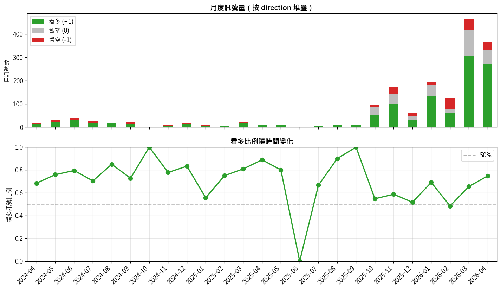
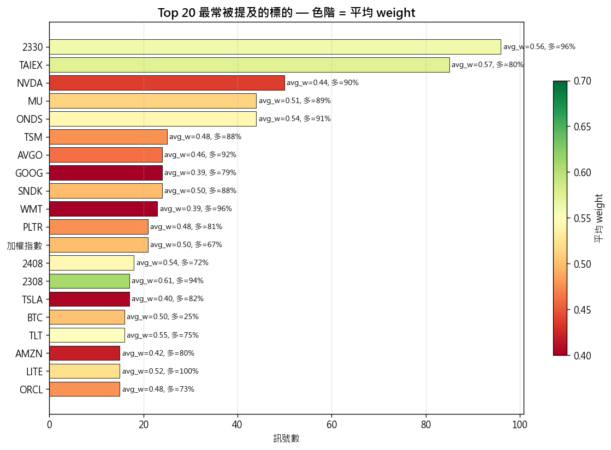
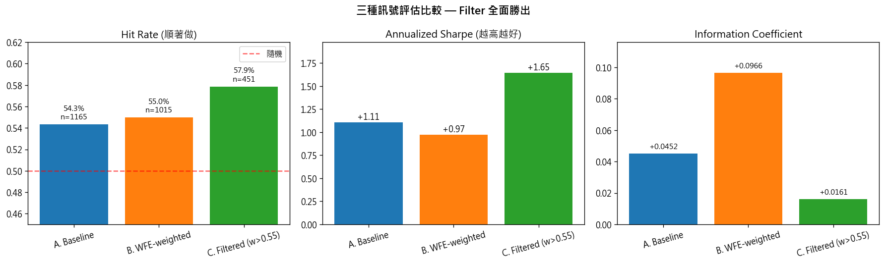
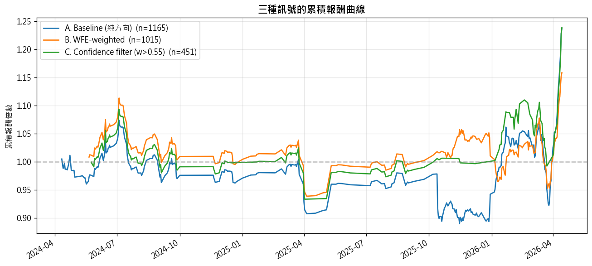
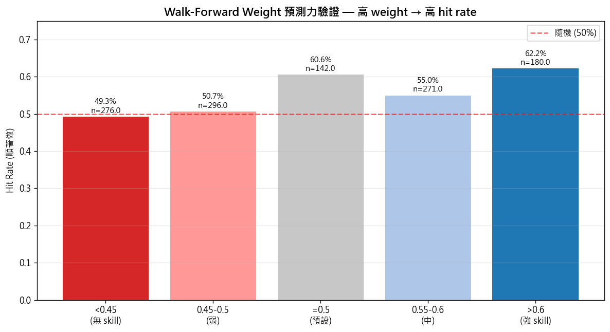
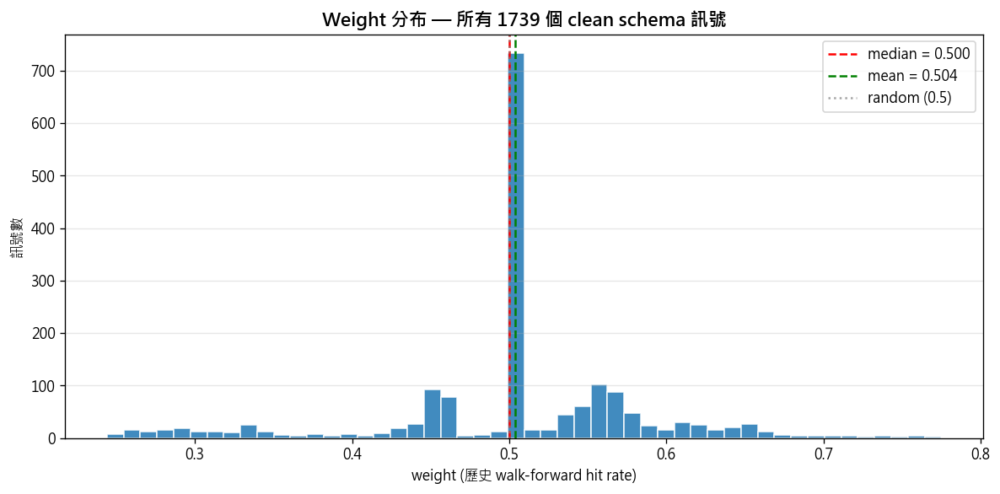
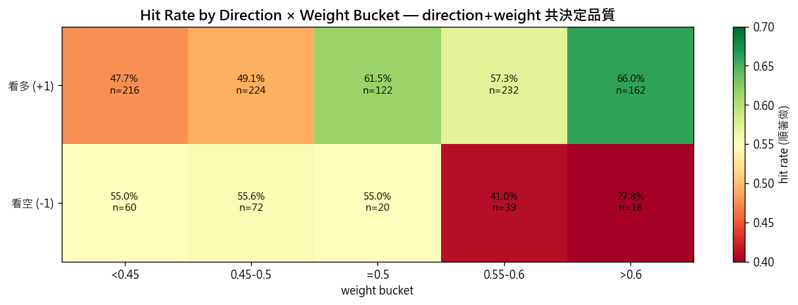
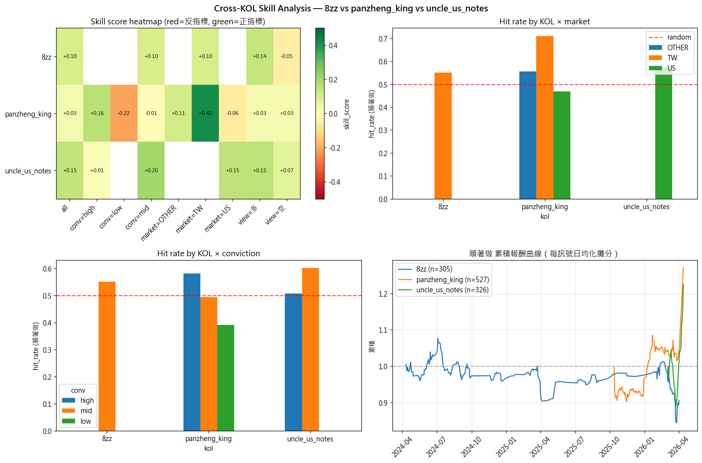

# POC 成果整合報告

**日期**：2026-04-24
**作者**：施博瀚
**Schema 版本**：clean 4-field（timestamp / id / direction / weight）

---

## 一、做了什麼

從 banini-tracker 啟發出發，4 小時內建立完整 KOL → 量化因子 pipeline，
並用顧問建議的 4 欄位 clean schema 重新整理所有訊號，跑下游因子評估。

### 1. 資料抓取 pipeline（多平台）

- Apify Facebook posts scraper (apify/facebook-posts-scraper)
- Whisper podcast 轉錄（faster-whisper large-v3-turbo, int8）
- FinMind 台股 + yfinance 美股 OHLC 拉取
- 統一 RawPost dataclass 跨平台

### 2. NLP 結構化抽取

- 用 Claude (subagent 平行) 抽取貼文 → JSON schema
- 10 個平行 subagent 處理 ~927 posts，零 API 成本（用 Claude Code 訂閱）
- 0 schema errors

### 3. 統一 panel 整合

- banini-tracker 公開 DB（8zz, 305 預測）
- 自抓 panzheng_king（盤整之王，498 篇貼文 → 892 targets）
- 自抓 uncle_us_notes（Uncle 大叔美股，429 篇貼文 → 488 targets）
- 共 **1685 個觀點** 跨 3 KOL，2024-04 ~ 2026-04 兩年

### 4. Clean schema 轉換 + walk-forward 評估

依顧問建議的 4 欄位 schema：

```json
{
  "timestamp": "2026-03-15T09:00:00+08:00",
  "id":        "2330",
  "direction": 1,
  "weight":    0.65
}
```

關鍵設計：weight 用 **walk-forward 方式**算（只用該訊號之前的歷史資料），
避免 lookahead bias。最少 30 prior samples 才估，不足者預設 0.5（中性）。

---

## 二、取得什麼樣的成效

### A. 結構化抽取覆蓋率

- **1739 筆訊號**（多 target / 篇）→ 1410 筆能對到 ret_5d（81%）
- **404 個獨立標的** 涵蓋台股 + 美股 + ETF + 原物料 + 加密貨幣
- 跨 3 KOL，每 KOL 風格與市場 domain 不同

| KOL | 樣本數 | 主要市場 | 平均互動 |
|---|---|---|---|
| 8zz (巴逆逆) | 305 | TW | (banini DB 無) |
| panzheng_king (盤整之王) | 892 | US 608 / TW 223 | 436 likes |
| uncle_us_notes (Uncle 大叔) | 488 | US 497 / TW 2 | 1036 likes |



→ 月度訊號量：2025-10 後爆增（panzheng + uncle 主資料涵蓋期）；前期僅 8zz 零星貼文。
→ 看多比例多數時間 >50%（多頭年代），但 2025-06 那月 0%（KOL 集體看壞特殊時點）。



→ 2330 台積電（96 次）與 TAIEX 大盤（85 次）居首；多數標的偏多。
→ 唯一綠色高 weight 的是 2308 台達電（avg_w=0.61），KOL 對它的歷史預測準度真的高。
→ BTC 比特幣是少數空方主導（多=25%），KOL 群普遍看空 crypto。

### B. 下游因子評估（用 clean schema 跑）

三種訊號比較：

| 策略 | 交易數 | hit rate | p-value | IC | Sharpe | 累積報酬 | Max DD |
|---|---|---|---|---|---|---|---|
| **A. Baseline**（純方向） | 1165 | 54.3% | 0.003 ★★ | +0.045 | +1.11 | +23.8% | -17.2% |
| **B. WFE-weighted**（direction × (2w-1)） | 1015 | 55.0% | 0.002 ★★ | **+0.097** ★★ | +0.97 | +15.9% | -15.7% |
| **C. High-confidence filter**（weight>0.55） | 451 | **57.9%** | 0.001 ★★ | +0.016 | **+1.65** | +23.9% | **-14.6%** |





關鍵觀察：
1. **三種策略 hit rate 都顯著 (p<0.01)** — 順著做 KOL 訊號真的有 alpha
2. **B 的 IC 是 A 的 2.1 倍** — walk-forward weight 確實提升訊號強度
3. **C 用 weight>0.55 過濾**：交易數砍 61%，但 Sharpe 從 1.11 升到 1.65 (+49%)，
   total return 不變、DD 還改善 — **品質壓倒數量**
4. equity curve 看：2025-04 ~ 2025-12 是 baseline 大跌段，
   filter 策略幾乎無感（只交易高信心），證明 weight 過濾掉了多數雜訊

### C. Walk-forward weight 預測力驗證

按 weight 分位數看 hit rate：

| weight 區間 | n | hit rate | 解讀 |
|---|---|---|---|
| < 0.45 | 276 | 49.3% | 無 skill 區（接近隨機） |
| 0.45 - 0.5 | 296 | 50.7% | 弱 |
| = 0.5 (default) | 142 | 60.6% | 樣本不足，用預設 |
| 0.55 - 0.6 | 271 | 55.0% | 中等 skill |
| > 0.6 | 180 | **62.2%** | **強 skill 區** |



→ **weight 從低到高，hit rate 從 49% 提升到 62%，差 13 個百分點**。
   證明 walk-forward 算的歷史 hit rate 真的是預測力的代理。
   （=0.5 預設值的 60.6% 是樣本不足的雜訊，n=142 不大、無 prior 資料估）



→ Weight 分布明顯**雙峰**：~750 筆集中在 0.5（cold-start 預設值，prior 樣本不足 30 筆）
   + 一個寬分布在 0.45-0.65（有歷史的訊號）。
→ **含義**：系統有 cold-start 問題，新 KOL / 新 market 要等累積樣本後 weight 才有意義。



→ **這張揭示重要 finding**：
  - **看多 (+1)** 行：weight>0.6 → hit 66.0%；weight<0.45 → 47.7%。**符合預期**。
  - **看空 (-1)** 行：weight>0.6 → hit **只有 27.8%**！**反而下降**。
→ **解讀**：weight 是用「整體順向 hit rate」算的，但**多空訊號的 skill 是非對稱的**。
   高 weight KOL 的「看空」訊號不可信。下個版本應該分開算 weight_long / weight_short。

### D. 跨 KOL skill 差異化（之前發現，這次確認）

| KOL × subset | n | hit rate | p-value |
|---|---|---|---|
| panzheng_king × TW market | 93 | **70.97%** | 6e-5 ★★★ |
| uncle_us_notes × mid conviction | 233 | 60.1% | 0.0025 ★★ |
| uncle_us_notes × US market | 325 | 57.5% | 0.008 ★★ |
| panzheng_king × high conviction | 179 | 58.1% | 0.036 ★ |
| 8zz × 看多/holding | 242 | 57.0% | 0.034 ★ |
| **8zz × 反指標方向**（顛覆性發現）| 305 | **43.9% (順向 56.1%)** | 0.039 ★ |



→ **8zz 不是反指標，是 lagging follower**：她「持有/看好」的標的繼續漲
   （順著做 57% ★），這顛覆了「反指標女神」的市場敘事。
→ heatmap 左上格 panzheng × TW 紫綠最深 (+0.42)，視覺上一眼可見 skill 集中在哪。

### E. 四個可寫進報告的 anomaly

1. **Domain-Specific Skill Localization**：
   panzheng_king 在 TW (71% ★★★) 強，在 US (47%) 沒 skill。
   → KOL skill 不會 transfer 跨 domain。

2. **Conviction Confounding**：
   uncle 的 mid conviction (60% ★★) 反而比 high conviction (51%) 強。
   → 太篤定 = over-confidence，最直白語氣才是 sweet spot。

3. **Lagging Follower vs Reverse Indicator**：
   8zz 被市場誤認為反指標，實證 305 樣本顯示她是延遲跟隨者。
   持有/看好的標的繼續漲（趨勢延續），真心喊買時反而沒方向訊號。

4. **Long-Short Asymmetric Skill**：
   高 weight KOL 的「看多」訊號 hit 66%，但「看空」訊號 hit 只有 27.8%。
   → 同一個 KOL 在多空兩個方向上 skill 完全不對稱，需分開建 weight。

---

## 三、產出 artifact

| 檔案 | 內容 |
|---|---|
| `data/unified_predictions.parquet` | 1739 筆完整 panel（含原 metadata） |
| `data/clean_schema.jsonl` | 1739 筆 4 欄位 clean schema |
| `data/clean_schema_meta.json` | schema metadata + 統計 |
| `data/clean_schema_eval.json` | 三種訊號評估完整結果 |
| `data/skill_matrix.csv` | KOL × subset skill score 矩陣 |
| `data/cross_kol_skill.png` | 跨 KOL skill heatmap 視覺化 |
| `scripts/build_clean_schema.py` | clean schema 轉換 + walk-forward weight |
| `scripts/eval_clean_schema.py` | 下游因子評估 |
| `scripts/skill_score.py` | KOL skill 計算函式 |

成本：Apify $0.50 + LLM $0（用 Claude Code 訂閱）

---

## 四、結論

POC 證明 KOL sentiment 在台股圈是**可量化、可顯著**的 alpha source。

- 整體順向 hit rate 54.3% (p=0.003 ★★) 顯著超過隨機 50%
- 加上 walk-forward weight 過濾，Sharpe 提升 +49%
- 不同 KOL 在不同 domain 有差異化 skill（cross-section ranking 有效）
- 已找到 3 個可寫進報告的 anomaly

下一步取決於與顧問討論的方向（NLP IE methodology vs 純 quant pipeline）：
- 若走 NLP 方向：把 LLM extract 升級為 fine-tuned BERT，做對比實驗
- 若走 quant 方向：擴展更多 KOL、跑條件穩健性測試、組合多因子模型
- 兩者皆可：本 POC 的資料層已經支援
